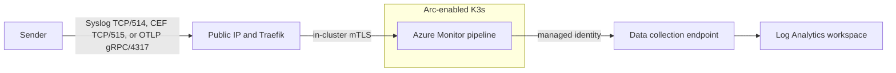

# Azure Monitor pipeline demo

This repository demonstrates an Azure-managed telemetry pipeline running on an
Arc-enabled K3s cluster. The full showcase accepts:

- Syslog over TCP/514 for appliances and legacy systems.
- CEF over Syslog/TCP on TCP/515 for security appliances.
- OpenTelemetry logs over OTLP/gRPC on TCP/4317 for modern applications.

You do not need to demonstrate every protocol. Choose the Syslog, CEF, or OTLP
experiment below and run only that traffic. The combined showcase pipeline remains
deployed, so switching experiments does not require redeployment.

## What the pipeline demonstrates

- Filtering low-value records before they cross the WAN.
- Redacting synthetic sensitive values before export.
- Aggregating Syslog into one-minute trend records.
- Buffering selected streams during a temporary cloud-path interruption.
- Managing and observing an edge collector centrally through Azure Monitor.



For component relationships, trust boundaries, deployment sequencing, and
complete dataflow details, see [architecture.md](docs/architecture.md).

## Script directories

Run commands from the repository root. Scripts are grouped by purpose:

| Directory | Purpose |
| --- | --- |
| [`deployment-scripts`](deployment-scripts) | Infrastructure deployment, showcase setup, endpoint lookup, cleanup, and internal guest configuration scripts. |
| [`generator-scripts`](generator-scripts) | Syslog, CEF, and OTLP traffic generators. |
| [`validation-scripts`](validation-scripts) | Base validation, readiness checks, recovery tests, and the internal cluster check. |
| [`operations-scripts`](operations-scripts) | Temporary DCE-path outage control used by the recovery demonstration. |
| [`script-modules`](script-modules) | Shared PowerShell configuration and Azure CLI helpers; these are imported by the user-facing scripts. |

## Deploy and configure

For a new environment, follow [basic-setup.md](docs/basic-setup.md). For an
existing environment, follow [demo-setup.md](docs/demo-setup.md).

After the infrastructure deployment succeeds,
`deployment-scripts\deploy.ps1` writes the
non-secret local configuration to the ignored `demo.config.psd1` file.
Subsequent commands load it automatically.

```powershell
@{
    SubscriptionId    = '00000000-0000-0000-0000-000000000000'
    ResourceGroupName = 'rg-arc-monitor-demo'
    NamePrefix        = 'arcmon'
    Endpoint          = '203.0.113.10'
}
```

For an existing deployment without this file:

```powershell
Copy-Item .\demo.config.example.psd1 .\demo.config.psd1
code .\demo.config.psd1
```

Retrieve its public endpoint using the subscription, resource group, and prefix
from the configuration:

```powershell
.\deployment-scripts\get-demo-endpoint.ps1
```

Copy the returned IP into `Endpoint`. For a configuration stored elsewhere, add
`-ConfigFile 'C:\demo\my-demo.config.psd1'` to any command. Explicit command-line
values override values loaded from the file.

Install the full showcase and verify the common infrastructure once:

```powershell
.\deployment-scripts\setup-demo.ps1
.\validation-scripts\validate.ps1
```

## Choose an experiment

Expand only the scenario you want to present.

<a id="syslog-experiment"></a>
<details>
<summary><strong>Syslog experiment</strong></summary>

### What this experiment shows

The Syslog path:

1. Receives RFC-compatible Syslog messages on TCP/514.
2. Normalizes fields with the `MicrosoftSyslog` processor.
3. Removes health and debug records before export.
4. Redacts the demonstration email and token in `SyslogMessage`.
5. Stores retained individual records in the built-in `Syslog` table.
6. Sends all source events through a parallel one-minute aggregation branch to
   `EdgeLogSummary_CL`.

The retained-record branch is intentionally nonpersistent. The summary exporter
has a persistent queue and can recover aggregate evidence after a temporary
DCE-path failure.

### Prepare the Syslog experiment

Run the protocol-specific readiness check:

```powershell
.\validation-scripts\test-demo-readiness.ps1 -Protocol Syslog
```

Open:

- **Azure Monitor** > **Pipelines** > `<prefix>-pipeline` > **Dataflows**.
- The retained Syslog and Syslog summary dataflows.
- The Log Analytics workspace **Logs** page.
- The pipeline **Monitoring** > **Metrics** page.

### Generate Syslog traffic

```powershell
.\generator-scripts\run-demo.ps1 `
    -DurationMinutes 2 `
    -EventsPerSecond 5 `
    -RunId 'SYSLOG-DEMO-20260924-01' `
    -Protocol Syslog
```

The actual first source message is shown by default, followed by an explanation
of which fields remain fixed and which fields change in later messages. It
contains only synthetic values. Pass `-ShowPayloadSample:$false` to suppress
this output.

### Verify ingestion

In the Azure portal, open the Log Analytics workspace, select **Logs**, paste
the following query, and select **Run**. This retrieves the most recently
ingested retained Syslog records:

```kusto
Syslog
| project TimeGenerated, Computer, SeverityLevel, ProcessName, SyslogMessage
| order by TimeGenerated desc
| take 20
```

Log Analytics ingestion can take several minutes. If the query initially
returns no records, wait briefly and run it again.

At the default duration and rate, the sender emits 600 Syslog messages. The
ten-event pattern contains five health/debug events and five retained events,
so a complete run should produce approximately:

- 300 filtered and redacted rows in `Syslog`.
- 600 source events represented by `sum(EdgeLogSummary_CL.EventCount)`.

Use the sender's final JSON counters as the exact result if timing creates a
partial final pattern.

### Verify filtering and redaction

```kusto
let RunId = "SYSLOG-DEMO-20260924-01";
Syslog
| where SyslogMessage contains RunId
| summarize
    Retained=count(),
    HealthRecords=countif(SyslogMessage contains "event_class=health"),
    DebugRecords=countif(tolower(SeverityLevel) == "debug"),
    UnredactedValues=countif(
        SyslogMessage contains "demo.user@example.com"
        or SyslogMessage contains "demo-token-123"
    ),
    RedactedEmails=countif(SyslogMessage contains "[REDACTED_EMAIL]"),
    RedactedTokens=countif(SyslogMessage contains "[REDACTED_TOKEN]")
```

Expected:

- `HealthRecords` is zero.
- `DebugRecords` is zero.
- `UnredactedValues` is zero.
- Both redaction-marker counts equal `Retained`.

### Verify aggregation

```kusto
let RunId = "SYSLOG-DEMO-20260924-01";
EdgeLogSummary_CL
| where DemoRunId == RunId
| summarize Events=sum(EventCount)
    by bin(TimeGenerated, 1m), Site, SeverityLevel
| order by TimeGenerated asc
```

The summed `EventCount` should equal the sender's final `counts.syslog`, including
the health/debug records excluded from `Syslog`.

### Demonstrate Syslog recovery

```powershell
.\validation-scripts\test-demo-recovery.ps1 `
    -Protocol Syslog `
    -OutageSeconds 60 `
    -EventsPerSecond 2
```

This proves that the durable summary branch drains after connectivity returns
and that new retained Syslog records resume. It does not claim lossless
individual-record delivery during the interruption.

Copy the `Recovery run ID` printed by the script into this Log Analytics query.
It compares retained raw records with the source-event counts recovered from
the durable summary branch:

```kusto
let RunId = "RECOVERY-20260924-143000-1234abcd";
union
(
    Syslog
    | where SyslogMessage contains RunId
    | summarize Events=count() by TimeGenerated=bin(TimeGenerated, 1m)
    | extend Stream="Retained Syslog records"
),
(
    EdgeLogSummary_CL
    | where DemoRunId == RunId
    | summarize Events=sum(EventCount) by TimeGenerated=bin(TimeGenerated, 1m)
    | extend Stream="All source events (durable summary)"
)
| project TimeGenerated, Stream, Events
| order by TimeGenerated asc, Stream asc
```

The durable summary should represent all source events after its queue drains.
The retained-record stream can contain fewer events during the outage, but
should contain new records after connectivity is restored.

</details>

<a id="cef-experiment"></a>
<details>
<summary><strong>Common Event Format (CEF) ingestion experiment</strong></summary>

### What this experiment shows

The CEF path:

1. Receives CEF messages carried by Syslog over TCP/515.
2. Parses them with the `MicrosoftCommonSecurityLog` processor.
3. Maps the fully formed CEF stream to the built-in `CommonSecurityLog` table.

This scenario demonstrates ingestion only. It does not apply filtering,
redaction, aggregation, or persistent recovery.

### Prepare the CEF experiment

CEF requires the built-in `CommonSecurityLog` table. Enable Microsoft Sentinel
on the workspace and confirm this query resolves before running setup:

```kusto
CommonSecurityLog
| take 0
```

Apply the showcase overlay and run the CEF-specific readiness check:

```powershell
.\deployment-scripts\setup-demo.ps1
.\validation-scripts\test-demo-readiness.ps1 -Protocol CEF
```

### Generate CEF traffic

Send ten synthetic firewall events:

```powershell
.\generator-scripts\send-cef-demo.ps1 `
    -RunId 'CEF-DEMO-20260924-01' `
    -Count 10
```

The command prints the exact first CEF wire message, explains which fields
remain fixed and which change in later events, and prints a summary containing
the endpoint, run ID, and number of records sent.

### Verify ingestion

In the Log Analytics workspace, run:

```kusto
let RunId = "CEF-DEMO-20260924-01";
CommonSecurityLog
| where DeviceCustomString1 == RunId
| project
    TimeGenerated,
    DeviceVendor,
    DeviceProduct,
    DeviceVersion,
    DeviceEventClassID,
    Activity,
    LogSeverity,
    SourceIP,
    SourcePort,
    DestinationIP,
    DestinationPort,
    DeviceAction,
    ApplicationProtocol,
    DeviceCustomString1Label,
    DeviceCustomString1
| order by TimeGenerated desc
```

Expected values include:

- `DeviceVendor`: `Contoso`
- `DeviceProduct`: `Demo Firewall`
- `Activity`: `Allowed HTTPS connection`
- `DeviceCustomString1Label`: `DemoRunId`
- `DeviceCustomString1`: the supplied run ID

Log Analytics ingestion can take several minutes. The built-in table can exist
and still show zero rows until a valid CEF message completes this path.

</details>

<a id="otlp-experiment"></a>
<details>
<summary><strong>OpenTelemetry (OTLP) experiment</strong></summary>

### What this experiment shows

The OTLP path:

1. Receives OpenTelemetry logs over OTLP/gRPC on TCP/4317.
2. Removes health and debug records before export.
3. Redacts the demonstration email and token in the log body.
4. Preserves structured run, sequence, service, environment, site, trace,
   duration, and event-class attributes.
5. Stores retained records in `OTelLogs_CL`.
6. Uses a persistent exporter queue during temporary DCE-path failures.

### Prepare the OTLP experiment

Run the protocol-specific readiness check:

```powershell
.\validation-scripts\test-demo-readiness.ps1 -Protocol OTLP
```

Open:

- **Azure Monitor** > **Pipelines** > `<prefix>-pipeline` > **Dataflows**.
- The OTLP dataflow.
- The Log Analytics workspace **Logs** page.
- The pipeline **Monitoring** > **Metrics** page.

### Generate OTLP traffic

```powershell
.\generator-scripts\run-demo.ps1 `
    -DurationMinutes 2 `
    -EventsPerSecond 5 `
    -RunId 'OTLP-DEMO-20260924-01' `
    -Protocol OTLP
```

The first OTLP-enabled run creates a cached Python environment under the current
user's local application-data directory. Later runs reuse it. The actual first
logical OTLP record is shown by default, followed by an explanation of fixed
and varying fields; pass `-ShowPayloadSample:$false` to suppress it.

At the default duration and rate, the sender emits 600 OTLP records. The
ten-event pattern contains five health/debug events and five retained events,
so a complete run should produce approximately 300 filtered and redacted rows
in `OTelLogs_CL`.

### Verify filtering, redaction, and structured fields

```kusto
let RunId = "OTLP-DEMO-20260924-01";
OTelLogs_CL
| where DemoRunId == RunId
| summarize
    Retained=count(),
    DistinctSequences=dcount(SequenceNumber),
    HealthRecords=countif(EventClass == "health"),
    DebugRecords=countif(SeverityText == "DEBUG"),
    UnredactedValues=countif(
        Body contains "demo.user@example.com"
        or Body contains "demo-token-123"
    ),
    RedactedEmails=countif(Body contains "[REDACTED_EMAIL]"),
    RedactedTokens=countif(Body contains "[REDACTED_TOKEN]")
```

Expected:

- `HealthRecords` is zero.
- `DebugRecords` is zero.
- `UnredactedValues` is zero.
- Both redaction-marker counts equal `Retained`.
- `DistinctSequences` equals `Retained`.

Inspect representative structured records:

```kusto
let RunId = "OTLP-DEMO-20260924-01";
OTelLogs_CL
| where DemoRunId == RunId
| project
    TimeGenerated,
    SequenceNumber,
    SeverityText,
    EventClass,
    ServiceName,
    DeploymentEnvironment,
    Site,
    TraceId,
    DurationMs,
    Body
| order by SequenceNumber desc
| take 10
```

### Demonstrate OTLP recovery

```powershell
.\validation-scripts\test-demo-recovery.ps1 `
    -Protocol OTLP `
    -OutageSeconds 60 `
    -EventsPerSecond 2
```

The recovery test keeps sending while the DCE route is unavailable, restores
the route, and verifies complete retained sequence coverage after the persistent
queue drains.

</details>

## Shared operational notes

- The deployed showcase keeps all three receivers available. Selecting a scenario
  changes only generated traffic and validation; it does not redeploy Azure
  resources.
- Log Analytics ingestion can take several minutes after the sender stops.
- The public client-to-Traefik hop is raw protocol transport. The
  Traefik-to-pipeline hop uses mTLS.
- Only the CIDR configured during deployment can reach TCP/514, TCP/515, and
  TCP/4317.
- The Syslog scenario is generally available. The OTLP receiver and OTLP log
  path used by this demo are preview features.
- Retained individual Syslog records use the built-in `Syslog` table.
  `EdgeLogSummary_CL` remains custom because aggregate rows are not individual
  Syslog events.
- Parsed CEF records use the built-in `CommonSecurityLog` table, which must
  exist before `deployment-scripts\setup-demo.ps1` deploys the CEF path.

If an interrupted recovery test leaves the DCE route blocked, restore it:

```powershell
.\operations-scripts\set-demo-outage.ps1 -Action Restore
```

For detailed setup, storage, readiness, and troubleshooting instructions, see
[demo-setup.md](docs/demo-setup.md). For implementation details, see
[architecture.md](docs/architecture.md).

## Clean up

Cleanup deletes the entire standalone resource group and prompts for
confirmation:

```powershell
.\deployment-scripts\cleanup.ps1
```

For unattended cleanup, add `-Force`. The script refuses to delete a resource
group that does not carry the standalone demo workload tag.

## Reference documentation

- [Azure Monitor pipeline overview](https://learn.microsoft.com/azure/azure-monitor/data-collection/pipeline-overview)
- [Create an Azure Monitor pipeline](https://learn.microsoft.com/azure/azure-monitor/data-collection/pipeline-configure)
- [Transform data in an Azure Monitor pipeline](https://learn.microsoft.com/azure/azure-monitor/data-collection/pipeline-transformations)
- [Persistent buffering](https://learn.microsoft.com/azure/azure-monitor/data-collection/pipeline-persistent-buffer)
- [Troubleshooting and pipeline metrics](https://learn.microsoft.com/azure/azure-monitor/data-collection/pipeline-troubleshoot)
