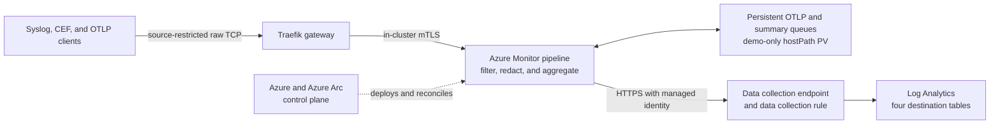
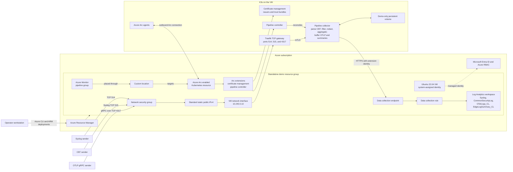
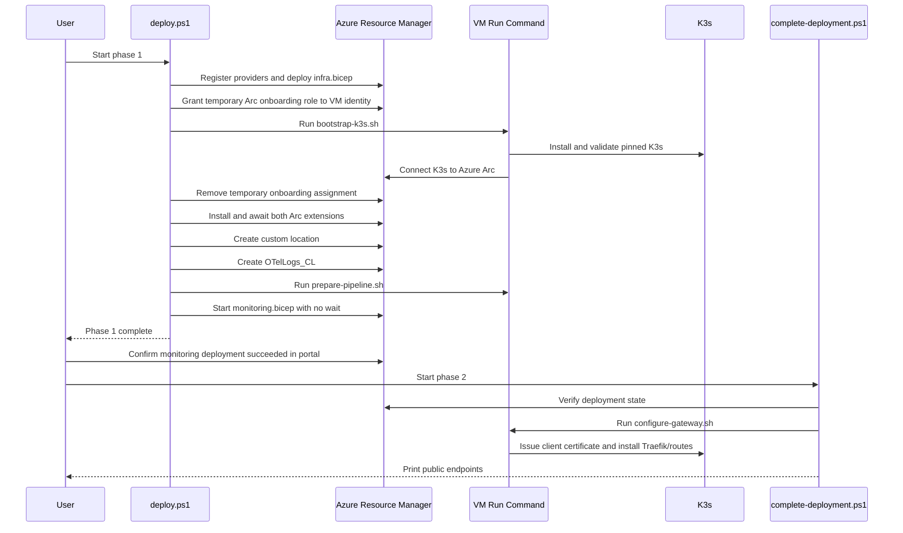
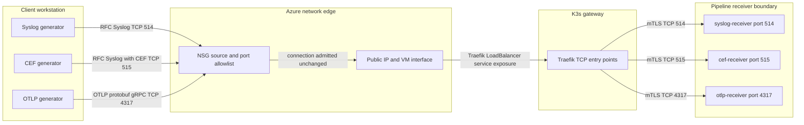
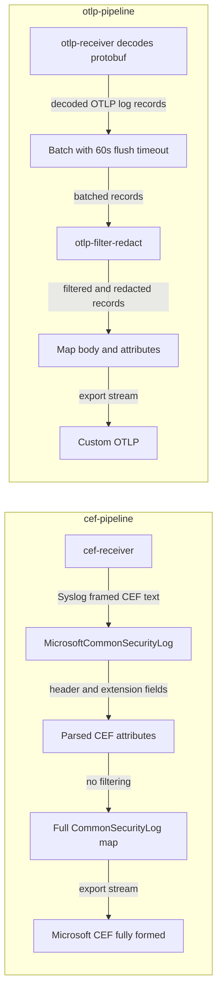
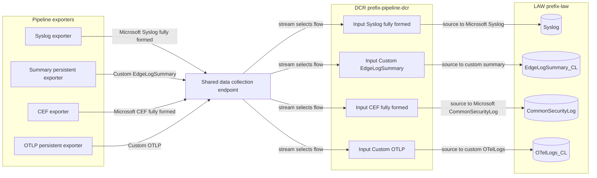
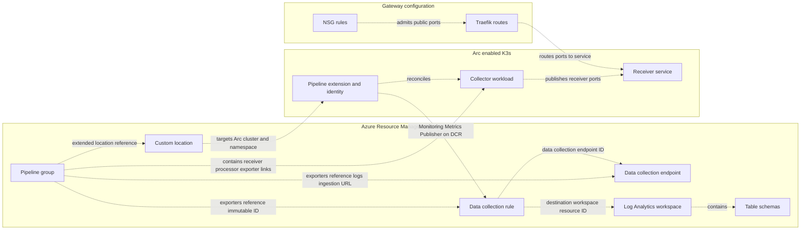

# Architecture

This page describes the complete architecture of the standalone Arc-enabled Azure Monitor pipeline demo. For deployment and validation commands, see [basic setup](basic-setup.md). For showcase installation, see [demo setup and operations](demo-setup.md). For protocol-specific walkthroughs, see the [Syslog, CEF, and OTLP experiment guide](../README.md).

## Purpose and scope

The demo creates a single-node K3s cluster on an Azure virtual machine, projects that cluster into Azure through Azure Arc, and schedules an Azure Monitor pipeline onto it through a custom location. Three source-restricted public TCP endpoints accept Syslog, CEF over Syslog, and OTLP gRPC traffic. An in-cluster Traefik gateway opens separate mutually authenticated TLS (mTLS) connections to the managed pipeline, which sends the records through an Azure Monitor data collection endpoint and data collection rule into Log Analytics.

This is an isolated demonstration environment, not a production reference architecture. It intentionally uses one VM, public ingestion endpoints, public Azure Monitor ingestion, and the preview OTLP log receiver. The Syslog pipeline scenario is generally available.

## Architecture at a glance



This is an edge-to-cloud telemetry path with an Azure-managed control plane. Azure Resource Manager defines the pipeline, Azure Arc and the custom location place it on K3s, and the pipeline extension reconciles the requested state inside the cluster. The data plane accepts Syslog, CEF, and OTLP logs, normalizes or maps them into DCR streams, and exports them to one dedicated Log Analytics workspace.

The base configuration demonstrates:

- Central deployment and lifecycle management of an edge collector through Azure Arc.
- Syslog, CEF, and preview OTLP log collection through one showcase pipeline group.
- Source-restricted public ingress, an mTLS-protected in-cluster backend hop, and managed-identity export to Azure Monitor.
- Standard Syslog normalization with the `MicrosoftSyslog` processor, CEF
  parsing with `MicrosoftCommonSecurityLog`, and explicit OTLP field mapping.
- Repeatable infrastructure deployment plus marker-based end-to-end ingestion checks.

The additive showcase in `demo/showcase.bicep` keeps the same core infrastructure, then updates the NSG, gateway, DCR, and pipeline group in place. It adds CEF TCP/515 ingestion to `CommonSecurityLog`, filters low-value health/debug records, redacts fixed synthetic values, preserves richer OTLP context, fans Syslog into a one-minute aggregation path, and enables persistent queues for OTLP and Syslog summaries. CEF and individual Syslog export remain non-persistent. `setup-demo.ps1` verifies that Sentinel has provisioned `CommonSecurityLog`, creates the custom summary table and a single-node demo volume, applies the overlay, and updates Traefik. The pipeline's built-in Azure Monitor metrics provide CPU, memory, uptime, sent-record, and failed-record views; no custom workbook is required.

The base `monitoring.bicep` remains intentionally straight through. Deploying it again replaces the showcase pipeline configuration, after which `setup-demo.ps1` must be rerun.

## Detailed system topology



The arrows represent logical relationships. The public IP is attached directly to the VM network interface. K3s provides the implementation behind Traefik's `LoadBalancer` service on the single node; there is no separate Azure Load Balancer resource in the template.

## Azure resource plane

All resources are placed in one dedicated resource group and tagged with `workload=azure-monitor-pipeline-demo` and `environment=demo` where tags are supported. The prefix supplied to the deployment controls the resource names.

| Resource | Default name pattern | Responsibility |
| --- | --- | --- |
| Virtual network | `<prefix>-vnet` | Provides the `10.240.0.0/16` private address space. |
| K3s subnet | `k3s` | Uses `10.240.0.0/24` and carries the network security group. |
| Network security group | `<prefix>-nsg` | Allows inbound TCP/514, TCP/515, and TCP/4317 only from `AllowedSourceCidr`; all other unsolicited inbound traffic is denied by the default rules. |
| Public IP | `<prefix>-pip` | Provides a static Standard IPv4 address for the three showcase endpoints. |
| Network interface | `<prefix>-nic` | Connects the VM at static private address `10.240.0.10` and associates the public IP. |
| Virtual machine | `<prefix>-k3s` | Runs Ubuntu 22.04, K3s, Arc agents, extensions, the pipeline, and Traefik. |
| Log Analytics workspace | `<prefix>-law` | Stores retained Syslog in `Syslog`, parsed CEF in `CommonSecurityLog`, and showcase OTLP and aggregate records in `OTelLogs_CL` and `EdgeLogSummary_CL`. |
| Data collection endpoint | `<prefix>-dce` | Exposes the public Azure Monitor logs-ingestion endpoint used by the pipeline. |
| Arc-enabled Kubernetes | `<prefix>-k3s` | Azure control-plane representation of the K3s cluster. |
| Certificate extension | `azure-cert-management` | Creates and rotates the roots, issuers, and trust bundles used by the pipeline. |
| Pipeline extension | `azure-monitor-pipeline` | Runs the pipeline controller and owns the managed identity used to publish records. |
| Custom location | `<prefix>-monitor` | Maps Azure resource placement to the Arc cluster, pipeline extension, and `azure-monitor-pipeline` namespace. |
| Custom table | `OTelLogs_CL` | Stores OTLP log fields `TimeGenerated`, `Body`, and `SeverityText`. |
| Built-in table | `Syslog` | Stores normalized Syslog records retained after showcase filtering and redaction. |
| Built-in table | `CommonSecurityLog` | Stores CEF records parsed by the showcase; provisioned by enabling Microsoft Sentinel before setup. |
| Custom table | `EdgeLogSummary_CL` | Stores one-minute Syslog event counts before raw-event filtering. |
| Data collection rule | `<prefix>-pipeline-dcr` | Maps the pipeline streams to the workspace and their destination tables. |
| Pipeline group | `<prefix>-pipeline` | Declares receivers, processing, exporters, and the four showcase log pipelines scheduled through the custom location. |

The VM uses a 64 GiB Premium SSD OS disk and defaults to `Standard_D4as_v5`. SSH key authentication is configured because Azure requires an administrator credential, but the network security group does not expose TCP/22. The Kubernetes API is also not published. Administrative guest actions use Azure VM Run Command.

## Kubernetes runtime plane

The VM hosts one K3s server and worker node. K3s is installed at the pinned version passed to `deploy.ps1`; the built-in Traefik installation is disabled so phase 2 can install the explicitly pinned chart. Host inotify limits are raised before Arc and pipeline workloads are installed.

The runtime is divided into these responsibilities:

- The `azure-arc` namespace contains the Arc agents that maintain the outbound connection to Azure and enable cluster-connect and custom-locations support.
- The certificate-management extension provides cert-manager integration, Azure Monitor root certificate Secrets, ClusterIssuers, and synchronized trust bundle ConfigMaps.
- The pipeline-controller extension uses the `azure-monitor-pipeline` namespace and reconciles the Azure `pipelineGroups` resource into an in-cluster pipeline workload and service.
- The managed showcase pipeline service exposes TCP/514, TCP/515, and TCP/4317 inside the cluster. Its server certificate is rooted in the Azure Monitor trust bundle and it requires a trusted client identity.
- Traefik runs as a single replica in the same namespace. Label-scoped Kubernetes CRD discovery restricts it to the routes created for this demo.

The custom location is the bridge between Azure Resource Manager and this runtime. It references the Arc cluster as its host, associates the pipeline-controller extension, and selects `azure-monitor-pipeline` as its namespace. Deploying the pipeline group with that custom location causes the extension controller to materialize the pipeline on K3s.

## Deployment control flow

Deployment is deliberately split into two phases because creation of the pipeline group can remain in progress long enough to outlive a practical local polling loop.



### Phase 1: infrastructure, Arc, and pipeline submission

`deploy.ps1` performs the following ordered operations:

1. Validates inputs, selects the subscription, installs required Azure CLI extensions, and registers the required resource providers.
2. Creates or verifies the tagged resource group. An existing group without the standalone workload tag is rejected to prevent accidental reuse.
3. Deploys `infra.bicep`, producing the network, VM, workspace, and data collection endpoint, then writes the reusable non-secret outputs to the ignored local `demo.config.psd1`.
4. Temporarily grants the VM's system-assigned identity `Kubernetes Cluster - Azure Arc Onboarding` at resource-group scope.
5. Runs `bootstrap-k3s.sh` through VM Run Command. The script installs K3s, Helm, Azure CLI, and the required CLI extensions; signs in with the VM identity; connects the cluster to Arc; enables cluster-connect and custom-locations; and verifies the Arc deployments and exact K3s version.
6. Removes the temporary role assignment in a `finally` block when the deployment created that assignment.
7. Installs and waits for the certificate-management and pipeline-controller Arc extensions.
8. Creates the custom location and waits for it to succeed.
9. Creates `OTelLogs_CL` through the Log Analytics tables REST API and waits for provisioning.
10. Runs `prepare-pipeline.sh` to label the namespace, wait for certificate roots and issuers, and verify synchronized trust bundles.
11. Starts `monitoring.bicep` asynchronously as `<prefix>-monitoring`, then returns control to the operator.

The script is restart-aware for the Arc connection, extensions, custom location, table, and certificate preparation. A failed or canceled custom location is deleted before it is recreated.

### Portal gate

The operator waits for the `<prefix>-monitoring` resource-group deployment to reach `Succeeded`. This deployment creates the DCR, grants the pipeline extension identity access to that DCR, and creates the pipeline group. The explicit gate prevents gateway configuration from racing the controller-created service and endpoints.

### Phase 2: gateway publication

`complete-deployment.ps1` does not poll. It first requires the monitoring deployment to have already succeeded, then runs `configure-gateway.sh` through VM Run Command. That script:

1. Verifies the pipeline trust bundle and waits for the controller-created
   service to expose the requested ports. Phase 2 requires the base TCP/514 and
   TCP/4317 endpoints; showcase setup additionally requires TCP/515.
2. Requests a 48-hour ECDSA client certificate, renewed 24 hours before expiry, from the Azure Monitor client-root ClusterIssuer.
3. Installs the pinned Traefik CRDs and creates one `ServersTransportTCP` plus separate Syslog and OTLP `IngressRouteTCP` resources.
4. Configures backend TLS with hostname verification, the synchronized server root CA, and the generated client certificate. `insecureSkipVerify` is disabled.
5. Installs the pinned Traefik chart with only TCP/514 and TCP/4317 exposed and waits for the deployment to become available.

Phase 2 is idempotent: Kubernetes resources are applied declaratively and Helm uses `upgrade --install`.

## Identity, authorization, and trust

Three identity contexts have different responsibilities.

| Identity | Scope and lifetime | Use |
| --- | --- | --- |
| Operator's Azure CLI identity | Subscription and resource group; deployment time | Creates the resource group, resources, extensions, custom location, table, and role assignments. |
| VM system-assigned managed identity | VM lifetime; onboarding elevation is temporary | Authenticates from the guest to create or repair the Arc connection. The deployment removes the onboarding assignment it creates even when bootstrap fails. |
| Pipeline extension managed identity | Extension lifetime; DCR scope | Receives `Monitoring Metrics Publisher` on the DCR and authenticates pipeline export to Azure Monitor. |

The Custom Locations service principal object ID is resolved in the tenant and supplied during Arc onboarding so the feature can establish its required Kubernetes authorization. No long-lived service-principal secret is created by this package.

Transport trust is separate from Azure RBAC. The certificate extension maintains the Azure Monitor certificate hierarchy. Namespace labels request server and client trust bundles. Traefik presents a short-lived client certificate to the pipeline, validates the pipeline service certificate against `arc-amp-trust-bundle`, and checks the service's cluster DNS name.

The certificate-management extension can create base root CA Secrets before it creates the active `-current` aliases expected by its ClusterIssuers. `prepare-pipeline.sh` includes an idempotent compatibility step that creates the missing aliases in-cluster without printing certificate or key material.

## Telemetry data flow

### Detailed processing-unit and DCR flow

The deployed showcase has one active DCR,
`<prefix>-pipeline-dcr`. That DCR contains four independent data flows. The
following diagram expands the high-level topology into the actual receivers,
logical pipelines, processing units, exporter record maps, DCR streams, and
destination tables.

```mermaid
flowchart LR
    subgraph dfClients["Client workstation"]
        dfSysClient["Syslog sender"]
        dfCefClient["CEF sender"]
        dfOtlpClient["OTLP sender"]
    end

    subgraph dfIngress["Source restricted ingress"]
        dfNsg["Network security group"]
        dfPublicIp["Public IP and VM interface"]
        dfTraefik["Traefik TCP gateway"]
    end

    subgraph dfControl["Azure and Arc control plane"]
        dfPipelineGroup["Pipeline group resource"]
        dfCustomLocation["Custom location"]
        dfArcController["Arc pipeline controller"]
    end

    subgraph dfCollector["Azure Monitor pipeline collector"]
        dfSysReceiver["Syslog receiver port 514"]
        dfCefReceiver["CEF receiver port 515"]
        dfOtlpReceiver["OTLP receiver port 4317"]

        subgraph dfSysPipeline["syslog-pipeline"]
            dfSysNormalize["MicrosoftSyslog normalize"]
            dfSysFilter["Transform filter and redact"]
            dfSysMap["Exporter Syslog record map"]
        end

        subgraph dfSummaryPipeline["syslog-summary-pipeline"]
            dfSummaryNormalize["MicrosoftSyslog normalize"]
            dfSummaryBatch["Batch with 60s flush timeout"]
            dfSummaryTransform["Transform extract and summarize"]
            dfSummaryMap["Persistent exporter record map"]
        end

        subgraph dfCefPipeline["cef-pipeline"]
            dfCefParse["MicrosoftCommonSecurityLog parse"]
            dfCefMap["Exporter CEF record map"]
        end

        subgraph dfOtlpPipeline["otlp-pipeline"]
            dfOtlpBatch["Batch with 60s flush timeout"]
            dfOtlpFilter["Transform filter and redact"]
            dfOtlpMap["Persistent exporter record map"]
        end
    end

    dfDce["Data collection endpoint"]

    subgraph dfDcr["DCR prefix-pipeline-dcr"]
        dfDcrSys["Syslog fully formed to Syslog"]
        dfDcrSummary["Custom summary to summary table"]
        dfDcrCef["CEF fully formed to CommonSecurityLog"]
        dfDcrOtlp["Custom OTLP to OTelLogs"]
    end

    subgraph dfLaw["Log Analytics workspace prefix-law"]
        dfSysTable[("Syslog table")]
        dfSummaryTable[("EdgeLogSummary_CL table")]
        dfCefTable[("CommonSecurityLog table")]
        dfOtlpTable[("OTelLogs_CL table")]
    end

    dfSysClient -->|"Syslog TCP 514"| dfNsg
    dfCefClient -->|"CEF over Syslog TCP 515"| dfNsg
    dfOtlpClient -->|"OTLP gRPC TCP 4317"| dfNsg
    dfNsg -->|"allowed source CIDR"| dfPublicIp
    dfPublicIp -->|"K3s service traffic"| dfTraefik
    dfTraefik -->|"mTLS port 514"| dfSysReceiver
    dfTraefik -->|"mTLS port 515"| dfCefReceiver
    dfTraefik -->|"mTLS port 4317"| dfOtlpReceiver

    dfSysReceiver -->|"individual records"| dfSysNormalize
    dfSysNormalize -->|"normalized attributes"| dfSysFilter
    dfSysFilter -->|"retained and redacted"| dfSysMap

    dfSysReceiver -->|"parallel pre-filter branch"| dfSummaryNormalize
    dfSummaryNormalize -->|"all source records"| dfSummaryBatch
    dfSummaryBatch -->|"one minute windows"| dfSummaryTransform
    dfSummaryTransform -->|"aggregate rows"| dfSummaryMap

    dfCefReceiver -->|"Syslog framed CEF"| dfCefParse
    dfCefParse -->|"parsed CEF attributes"| dfCefMap

    dfOtlpReceiver -->|"OTLP log records"| dfOtlpBatch
    dfOtlpBatch -->|"batched records"| dfOtlpFilter
    dfOtlpFilter -->|"retained and redacted"| dfOtlpMap

    dfSysMap -->|"Microsoft Syslog fully formed"| dfDce
    dfSummaryMap -->|"Custom EdgeLogSummary"| dfDce
    dfCefMap -->|"Microsoft CEF fully formed"| dfDce
    dfOtlpMap -->|"Custom OTLP"| dfDce

    dfDce -->|"Microsoft Syslog fully formed"| dfDcrSys
    dfDce -->|"Custom EdgeLogSummary"| dfDcrSummary
    dfDce -->|"Microsoft CEF fully formed"| dfDcrCef
    dfDce -->|"Custom OTLP"| dfDcrOtlp

    dfDcrSys -->|"source transform and route"| dfSysTable
    dfDcrSummary -->|"source transform and route"| dfSummaryTable
    dfDcrCef -->|"source transform and route"| dfCefTable
    dfDcrOtlp -->|"source transform and route"| dfOtlpTable

    dfPipelineGroup -.->|"targets"| dfCustomLocation
    dfCustomLocation -.->|"places resource on Arc cluster"| dfArcController
    dfArcController -.->|"reconciles collector configuration"| dfSysReceiver
    dfArcController -.->|"reconciles collector configuration"| dfCefReceiver
    dfArcController -.->|"reconciles collector configuration"| dfOtlpReceiver
```

<!-- mermaid-checked: no \n, no em-dash/en-dash, no {} in labels, subgraphs are id["label"], arrows are -->|"label"|, all subgraphs closed by end, ids unique -->


Solid arrows are data-plane movement. Dotted arrows are control-plane
relationships. In particular, telemetry does **not** flow through the custom
location. The custom location tells Azure where the pipeline group must run;
the Arc pipeline controller then materializes and reconciles the collector on
K3s.

Each exporter performs a schema conversion before calling the DCE:

- The Syslog exporter maps normalized attributes into
  `Microsoft-Syslog-FullyFormed`.
- The summary exporter maps aggregate fields into
  `Custom-EdgeLogSummary`.
- The CEF exporter maps parsed attributes into
  `Microsoft-CommonSecurityLog-FullyFormed`.
- The OTLP exporter maps protobuf fields and attributes into `Custom-OTLP`.

The DCR is the final cloud-side processing and routing layer. All four current
`transformKql` expressions are `source`, so they pass records through without
changing values. Each DCR data flow still changes the stream contract from its
input stream to the output stream associated with its destination table.

| Logical pipeline | Receiver input | Pipeline transformations | Exporter stream | DCR output stream | LAW table |
| --- | --- | --- | --- | --- | --- |
| `syslog-pipeline` | RFC Syslog on TCP/514 | Normalize; remove health/debug; redact email/token; map standard fields | `Microsoft-Syslog-FullyFormed` | `Microsoft-Syslog` | `Syslog` |
| `syslog-summary-pipeline` | Same TCP/514 receiver, parallel branch | Normalize; batch with 60-second flush timeout; extract run/site; bucket by minute; aggregate by run, site, and severity; map fields | `Custom-EdgeLogSummary` | `Custom-EdgeLogSummary_CL` | `EdgeLogSummary_CL` |
| `cef-pipeline` | CEF inside Syslog on TCP/515 | Parse CEF header/extensions; map full standard schema | `Microsoft-CommonSecurityLog-FullyFormed` | `Microsoft-CommonSecurityLog` | `CommonSecurityLog` |
| `otlp-pipeline` | OTLP logs on TCP/4317 | Batch; remove health/debug; redact email/token; map body and attributes | `Custom-OTLP` | `Custom-OTelLogs_CL` | `OTelLogs_CL` |

### Focused view 1: from the workstation to a pipeline receiver

This view stops at the first processing boundary. All three senders run on the
client workstation and connect to the same public IP. The NSG does not parse or
change records; it only accepts connections from `AllowedSourceCidr` on the
three configured ports. Traefik also does not change message content. It
selects a route by destination port and creates a separate mTLS connection to
the corresponding in-cluster receiver.

<!-- mermaid-checked: no \n, no em-dash/en-dash, no {} in labels, subgraphs are id["label"], arrows are -->|"label"|, all subgraphs closed by end, ids unique -->


**What changes here:** only the transport connection. The bytes sent by the
workstation remain unchanged until a receiver decodes its protocol.

**What controls this part:** the NSG rules hold the source CIDR and public-port
allowlist; the Traefik entry points and `IngressRouteTCP` objects bind each
public port to the matching receiver port; the pipeline group receiver
definitions tell the collector which protocols and ports to listen on.

### Focused view 2: Syslog normalization, filtering, and fan-out

One received Syslog record is copied into two logical pipelines. The retained
record path transforms individual events for the built-in `Syslog` table. The
summary path branches before filtering, so it sees every source event and
produces aggregate rows instead of individual Syslog records.

```mermaid
flowchart LR
    syReceiver["syslog-receiver"]

    subgraph syRetained["syslog-pipeline"]
        syNormalize["MicrosoftSyslog retained path"]
        syTransform["syslog-filter-redact"]
        syStandardMap["Map standard Syslog schema"]
        syStandardStream["Microsoft Syslog fully formed"]
    end

    subgraph sySummary["syslog-summary-pipeline"]
        sySummaryNormalize["MicrosoftSyslog summary path"]
        syBatch["Batch with 60s flush timeout"]
        syExtract["Extract run ID and site"]
        syAggregate["Bucket and count by run site severity"]
        sySummaryMap["Map summary schema"]
        sySummaryStream["Custom EdgeLogSummary"]
    end

    syReceiver -->|"copy of each source record"| syNormalize
    syNormalize -->|"normalized fields"| syTransform
    syTransform -->|"filtered and redacted records"| syStandardMap
    syStandardMap -->|"export stream"| syStandardStream

    syReceiver -->|"parallel pre-filter copy"| sySummaryNormalize
    sySummaryNormalize -->|"all normalized records"| syBatch
    syBatch -->|"windowed records"| syExtract
    syExtract -->|"grouping fields"| syAggregate
    syAggregate -->|"aggregate rows"| sySummaryMap
    sySummaryMap -->|"export stream"| sySummaryStream
```

<!-- mermaid-checked: no \n, no em-dash/en-dash, no {} in labels, subgraphs are id["label"], arrows are -->|"label"|, all subgraphs closed by end, ids unique -->


**Where the data changes:**

1. `MicrosoftSyslog` parses the RFC header and creates normalized attributes
   such as `SeverityLevel`, `ProcessName`, and `SyslogMessage`.
2. The single `syslog-filter-redact` processor removes health/debug records and
   replaces the fixed email and token in retained records.
3. `summary-batch` has a 60-second flush timeout. The `syslog-summary`
   transform creates the actual one-minute bucket with `bin(TimeGenerated,
   1m)`, extracts run ID and site, and counts by bucket, run ID, site, and
   severity. A minute can therefore contain multiple partial aggregate rows
   when batches split it; queries sum `EventCount` across those rows.
4. Each exporter record map selects and renames fields to match its stream
   schema.

**What controls this part:** the pipeline group's `service.pipelines` entries
link the shared receiver to ordered processor names and one exporter name.
Those named processor and exporter definitions are stored on the same pipeline
group resource. Both Syslog logical pipelines reference the same named
`syslog-processor` definition, but each branch processes its own copy of the
received record.

### Focused view 3: CEF and OTLP transformations

CEF and OTLP use independent receivers and logical pipelines. CEF is parsed but
not filtered or redacted. OTLP keeps its native log structure until the
transform removes low-value events and redacts the body.

<!-- mermaid-checked: no \n, no em-dash/en-dash, no {} in labels, subgraphs are id["label"], arrows are -->|"label"|, all subgraphs closed by end, ids unique -->


**Where the data changes:** `MicrosoftCommonSecurityLog` splits the CEF header
and extensions into the standard security-log attributes. The CEF record map
then aligns those attributes with the full built-in table schema. For OTLP, the
receiver decodes protobuf, the single `otlp-filter-redact` transform drops
health/debug events and redacts the body, and the exporter map projects
selected native fields and attributes into the custom stream. The OTLP batch
processor uses a 60-second flush timeout; it does not define an aggregation
window.

**What controls this part:** `cef-pipeline` names the CEF receiver, parser, and
exporter. `otlp-pipeline` names the OTLP receiver, ordered batch/transform
processors, and exporter. Because these lists are independent, changing one
path does not insert that processor into another path.

### Focused view 4: exporter streams, DCE, DCR, and LAW tables

This is the cloud-ingestion half of the path. Exporters authenticate with the
pipeline extension managed identity and submit records to the shared DCE. The
DCE is an endpoint, not a transformation engine. The stream name selects one
of four data flows in the active DCR. Each data flow applies its `transformKql`,
chooses an output stream, and routes the result to the workspace destination.

<!-- mermaid-checked: no \n, no em-dash/en-dash, no {} in labels, subgraphs are id["label"], arrows are -->|"label"|, all subgraphs closed by end, ids unique -->


**Where the data changes:** the exporter has already produced the DCR input
schema. The current DCR expressions are all `source`, so the DCR does not
change field values. It still changes the stream contract to the output stream
associated with the final table. A future nontrivial `transformKql` would be an
additional transformation at this point.

**What controls this part:** each exporter stores the DCE URL, DCR immutable ID,
input stream name, and record map. The DCR stores the workspace destination and
the four `dataFlows` entries that bind input streams to output streams. The LAW
table schema is the final contract that the DCR output must satisfy.

### Focused view 5: objects that hold and link configuration

This control-plane view shows where the instructions live. Dotted arrows mean
configuration or reconciliation, not telemetry movement.

<!-- mermaid-checked: no \n, no em-dash/en-dash, no {} in labels, subgraphs are id["label"], arrows are -->|"label"|, all subgraphs closed by end, ids unique -->


The principal configuration objects are:

| Object | Information it holds | Link to source or sink |
| --- | --- | --- |
| Pipeline group | Receiver endpoints; processor definitions; exporter record maps; ordered logical-pipeline membership | `service.pipelines` names one or more receivers, an ordered processor list, and one or more exporters |
| Custom location | Arc cluster, extension, namespace, and placement context | Referenced by the pipeline group's `extendedLocation`; no telemetry passes through it |
| Pipeline controller extension | Managed identity and reconciliation capability | Materializes the pipeline group as a collector workload and service on K3s |
| Traefik routes | Public entry point to backend service-port mapping and mTLS backend settings | Connect TCP/514, TCP/515, and TCP/4317 to the corresponding receiver ports |
| DCE | Cloud logs-ingestion URL | Referenced by every exporter; accepts records for the DCR |
| DCR | Input streams, `transformKql`, output streams, and LAW destination | DCR immutable ID is referenced by exporters; each data flow binds one input stream to one table-compatible output stream |
| LAW workspace | Destination container and query scope | Its resource ID is stored in the DCR destination |
| LAW table | Final standard or custom schema and retained records | Selected by the DCR output stream |

### Syslog

1. A permitted source opens a TCP connection to `<public-ip>:514` and sends an RFC-compatible Syslog message.
2. The subnet NSG admits the connection only when its source matches `AllowedSourceCidr`.
3. The VM public IP and K3s service path deliver the raw TCP stream to Traefik.
4. Traefik selects the Syslog TCP route and establishes an mTLS connection to `<prefix>-pipeline-service:514`.
5. The pipeline's Syslog receiver parses the input and the `MicrosoftSyslog` processor normalizes its fields.
6. The exporter maps those attributes to `Microsoft-Syslog-FullyFormed`, and the DCR writes them to the built-in `Syslog` table.
7. The additive showcase filters and redacts the normalized records before that exporter. A parallel pre-filter branch writes one-minute counts to `EdgeLogSummary_CL`.

### OTLP logs

1. A permitted source opens a gRPC connection to `<public-ip>:4317` and exports OTLP log records.
2. The NSG and Traefik carry the TCP stream to the pipeline's OTLP receiver over the same mTLS-protected backend pattern.
3. The exporter maps `severity_text`, `body`, and `time_unix_nano` to `SeverityText`, `Body`, and `TimeGenerated` in the declared `Custom-OTLP` stream.
4. The DCR maps `Custom-OTLP` to `Custom-OTelLogs_CL`, which lands in `OTelLogs_CL`.

### CEF

1. A permitted source opens a TCP connection to `<public-ip>:515` and sends a
   CEF event inside a Syslog message.
2. The source-restricted NSG rule and Traefik CEF route carry the stream to
   `<prefix>-pipeline-service:515` over the same mTLS backend pattern.
3. The `MicrosoftCommonSecurityLog` processor parses the CEF header and
   extension key/value pairs.
4. The exporter emits `Microsoft-CommonSecurityLog-FullyFormed`; the DCR maps
   it to `Microsoft-CommonSecurityLog` and the built-in `CommonSecurityLog`
   table.

The three routes share the data collection endpoint, DCR, workspace, pipeline
extension identity, and in-cluster pipeline service. They differ at the
receiver, optional processing, schema mapping, and destination table.

## Message formats and Log Analytics tables

The Syslog/OTLP traffic generator emits a repeating ten-event pattern. Five events are
health/debug records and five are retained transaction, warning, or error
records. Both protocols carry the same run and sequence identity so a
presentation can correlate source traffic with its Log Analytics result.

The separate CEF sender emits a requested count of synthetic firewall events.
CEF is an ingestion-only scenario and does not use the filtering, redaction,
aggregation, or recovery branches.

All payload values shown here are fixed synthetic demonstration values. They do
not contain credentials or customer data.

### What the generators print

`run-demo.ps1` shows the actual first Syslog and/or logical OTLP record after it
has been sent. Its accompanying explanation identifies:

- Fields fixed for the whole run, including run ID, site, environment, service
  identity, and the synthetic values intended for redaction.
- Fields that change for every record, including timestamp, sequence, duration,
  and deterministic trace ID.
- Fields selected from the repeating ten-message event pattern, including
  event class and severity.

`send-cef-demo.ps1` similarly prints the actual first CEF wire message. All CEF
records retain the same vendor, product, event class, activity, network
addresses, action, protocol, and run ID. Timestamp, Syslog process ID, source
port, and message sequence change for every record.

The small `send-syslog-demo.ps1` and `send-otlp-demo.ps1` connectivity probes
send only one record. They print that first and only record and explicitly say
that no later records exist for comparison.

### Source Syslog format

The sender writes newline-delimited RFC 5424-style messages over TCP/514:

```text
<14>1 2026-09-24T14:40:00.000000Z demo-sender arc-monitor-demo 3 DEMO - run_id=SYSLOG-DEMO-20260924-01 sequence=3 site=edge-01 environment=demo event_class=transaction severity=INFO duration_ms=131 trace_id=5043267231885ff98e927c8172bd8ca4 email=demo.user@example.com token=demo-token-123
```

The message has these parts:

| Part | Example | Meaning |
| --- | --- | --- |
| Priority and version | `<14>1` | RFC priority followed by Syslog version 1. The priority encodes facility and severity. |
| Timestamp | `2026-09-24T14:40:00.000000Z` | UTC event time generated by the sender. |
| Host name | `demo-sender` | Synthetic source host. |
| Application name | `arc-monitor-demo` | Synthetic source process. |
| Process ID | `3` | The event sequence is also used as the synthetic process ID. |
| Message ID | `DEMO` | Fixed demonstration identifier. |
| Structured data | `-` | This demo does not send an RFC structured-data block. |
| Message body | `run_id=... token=...` | Space-delimited demonstration fields processed by the pipeline. |

The `MicrosoftSyslog` processor parses the header and produces the fully formed
Syslog attributes. The exporter maps them to the built-in `Syslog` table:

| Normalized pipeline attribute | `Syslog` column | Type | Source |
| --- | --- | --- | --- |
| `TimeGenerated` | `TimeGenerated` | `datetime` | Normalized record time. |
| `CollectorHostName` | `CollectorHostName` | `string` | Collector context. |
| `Computer` | `Computer` | `string` | Normalized source computer. |
| `EventTime` | `EventTime` | `datetime` | RFC message timestamp. |
| `Facility` | `Facility` | `string` | Facility decoded from the priority. |
| `HostIP` | `HostIP` | `string` | Source address when available. |
| `HostName` | `HostName` | `string` | RFC host name. |
| `ProcessID` | `ProcessID` | `int` | RFC process ID. |
| `ProcessName` | `ProcessName` | `string` | RFC application name. |
| `SeverityLevel` | `SeverityLevel` | `string` | Severity decoded from the priority. |
| `SourceSystem` | `SourceSystem` | `string` | Collection-source classification. |
| `SyslogMessage` | `SyslogMessage` | `string` | Message body after pipeline processing. |

Log Analytics also supplies standard service-managed columns such as
`TenantId`, `Type`, `_BilledSize`, `_IsBillable`, `_ResourceId`, and
`_SubscriptionId`. Those columns are not sent or mapped by the demo.

### Source CEF format

The sender writes newline-delimited RFC 5424 Syslog messages over TCP/515. The
message body is a CEF version 0 event:

```text
<134>1 2026-09-24T15:00:00.000Z demo-cef-sender cef-demo 1 CEF - CEF:0|Contoso|Demo Firewall|1.0|100|Allowed HTTPS connection|5|src=192.0.2.10 dst=198.51.100.20 spt=50001 dpt=443 act=allow proto=TCP cs1Label=DemoRunId cs1=CEF-DEMO-20260924-01 msg=Synthetic CEF ingestion event 1
```

The CEF header supplies vendor, product, version, event class, activity, and
severity. The extension supplies source/destination network fields, action,
protocol, a human-readable message, and `cs1`/`cs1Label` correlation fields.
The `MicrosoftCommonSecurityLog` processor maps these values into
`CommonSecurityLog`.

### Source OTLP log format

OTLP records are sent as protobuf messages over insecure gRPC on TCP/4317. The
following JSON is a logical representation of one source record, not the
literal wire encoding:

```json
{
  "time_unix_nano": 1790253600000000000,
  "severity_text": "INFO",
  "body": "run_id=OTLP-DEMO-20260924-01 sequence=3 event_class=transaction email=demo.user@example.com token=demo-token-123",
  "attributes": {
    "DemoRunId": "OTLP-DEMO-20260924-01",
    "SequenceNumber": 3,
    "ServiceName": "checkout-api",
    "DeploymentEnvironment": "demo",
    "Site": "edge-01",
    "TraceId": "5043267231885ff98e927c8172bd8ca4",
    "DurationMs": 131.0,
    "EventClass": "transaction",
    "SeverityText": "INFO"
  }
}
```

The exporter maps the OTLP record into `OTelLogs_CL`:

| OTLP field | `OTelLogs_CL` column | Type |
| --- | --- | --- |
| `time_unix_nano` | `TimeGenerated` | `datetime` |
| `body` | `Body` | `string` |
| `severity_text` | `SeverityText` | `string` |
| `attributes.DemoRunId` | `DemoRunId` | `string` |
| `attributes.SequenceNumber` | `SequenceNumber` | `long` |
| `attributes.ServiceName` | `ServiceName` | `string` |
| `attributes.DeploymentEnvironment` | `DeploymentEnvironment` | `string` |
| `attributes.Site` | `Site` | `string` |
| `attributes.TraceId` | `TraceId` | `string` |
| `attributes.DurationMs` | `DurationMs` | `real` |
| `attributes.EventClass` | `EventClass` | `string` |

The source also includes `attributes.SeverityText` for payload inspection, but
the table's `SeverityText` column is populated from the OTLP
`severity_text` field.

### Filtering, redaction, and aggregation

The retained-record branches apply these rules before export:

- Drop records whose message body contains `event_class=health`.
- Drop Syslog records whose normalized `SeverityLevel` is `debug`.
- Drop OTLP records whose `SeverityText` is `DEBUG`.
- Replace `demo.user@example.com` with `[REDACTED_EMAIL]`.
- Replace `demo-token-123` with `[REDACTED_TOKEN]`.

Filtering and redaction do not rename or remove destination columns. The Syslog
branch therefore remains compatible with `Microsoft-Syslog-FullyFormed` and
the built-in `Syslog` table.

The Syslog summary branch runs before retained-record filtering. It extracts
`run_id` and `site` from every source message, groups records into one-minute
buckets by run, site, and severity, and counts them. This preserves evidence of
the full source volume, including health/debug records that are not retained as
individual events.

### Log Analytics table schemas

#### `Syslog`

`Syslog` is a built-in Log Analytics table. The pipeline-populated columns are:

| Column | Type | Description |
| --- | --- | --- |
| `TimeGenerated` | `datetime` | Normalized record time used for Log Analytics queries. |
| `CollectorHostName` | `string` | Host on which collection occurred, when supplied. |
| `Computer` | `string` | Normalized source computer. |
| `EventTime` | `datetime` | Time from the source Syslog event. |
| `Facility` | `string` | Syslog facility such as `user`. |
| `HostIP` | `string` | Source IP when available. |
| `HostName` | `string` | Source host from the RFC header. |
| `ProcessID` | `int` | Source process ID. |
| `ProcessName` | `string` | Source application or process name. |
| `SeverityLevel` | `string` | Normalized severity such as `info`, `warning`, or `error`. |
| `SourceSystem` | `string` | Azure Monitor source-system classification. |
| `SyslogMessage` | `string` | Filtered and redacted message body. |

#### `CommonSecurityLog`

`CommonSecurityLog` is a built-in table provisioned for this workspace by
Microsoft Sentinel. The demo uses these parsed columns:

| Column | Type | CEF source |
| --- | --- | --- |
| `TimeGenerated` | `datetime` | Normalized event ingestion time. |
| `DeviceVendor` | `string` | CEF header vendor, `Contoso`. |
| `DeviceProduct` | `string` | CEF header product, `Demo Firewall`. |
| `DeviceVersion` | `string` | CEF header version, `1.0`. |
| `DeviceEventClassID` | `string` | CEF header signature ID, `100`. |
| `Activity` | `string` | CEF header event name. |
| `LogSeverity` | `string` | Normalized CEF severity. |
| `SourceIP` | `string` | `src` extension. |
| `SourcePort` | `int` | `spt` extension. |
| `DestinationIP` | `string` | `dst` extension. |
| `DestinationPort` | `int` | `dpt` extension. |
| `DeviceAction` | `string` | `act` extension. |
| `ApplicationProtocol` | `string` | `proto` extension. |
| `DeviceCustomString1Label` | `string` | `cs1Label`, fixed to `DemoRunId`. |
| `DeviceCustomString1` | `string` | `cs1`, containing the sender run ID. |
| `Message` | `string` | `msg` extension. |

#### `OTelLogs_CL`

| Column | Type | Description |
| --- | --- | --- |
| `TimeGenerated` | `datetime` | OTLP record timestamp. |
| `Body` | `string` | Filtered and redacted log body. |
| `SeverityText` | `string` | OTLP severity text. |
| `DemoRunId` | `string` | Correlation identifier supplied to the sender. |
| `SequenceNumber` | `long` | Monotonically increasing sequence within the run. |
| `ServiceName` | `string` | Synthetic service name, `checkout-api`. |
| `DeploymentEnvironment` | `string` | Synthetic environment, `demo`. |
| `Site` | `string` | Synthetic edge site, `edge-01`. |
| `TraceId` | `string` | Deterministic synthetic trace identifier. |
| `DurationMs` | `real` | Synthetic operation duration in milliseconds. |
| `EventClass` | `string` | Source classification; retained rows are `transaction`, `warning`, or `error`. |

#### `EdgeLogSummary_CL`

| Column | Type | Description |
| --- | --- | --- |
| `TimeGenerated` | `datetime` | Start of the one-minute aggregation bucket. |
| `DemoRunId` | `string` | `run_id` extracted from the Syslog message body. |
| `Site` | `string` | `site` extracted from the Syslog message body. |
| `SeverityLevel` | `string` | Normalized Syslog severity used for grouping. |
| `EventCount` | `long` | Number of source Syslog events in the group. |

`Syslog` and `OTelLogs_CL` contain only retained individual records.
`EdgeLogSummary_CL` represents all source Syslog events and should not be added
to the individual-row count. Custom Log Analytics tables also receive standard
service-managed columns that are not declared by this demo.

## Network and security boundaries

- Only TCP/514, TCP/515, and TCP/4317 are explicitly admitted, and only from `AllowedSourceCidr`.
- SSH, the Kubernetes API, Traefik web entry points, and the Traefik dashboard are not exposed publicly.
- VM administration and script transfer use authenticated Azure VM Run Command through the Azure control plane.
- Arc agents initiate outbound connectivity; no inbound Arc management port is opened.
- The public client-to-Traefik hop is raw protocol transport. The protected mTLS boundary is the Traefik-to-pipeline hop inside K3s.
- The Log Analytics workspace permits public ingestion and query, and the DCE permits public network access. Private Link is outside this demo's scope.
- The single CIDR allowlist is the only network-level sender authorization. The demo does not configure application-layer client authentication on its public endpoints.
- The VM, K3s node, gateway, and pipeline are a single failure domain. There is no node redundancy, availability-zone design, autoscaling, or disaster-recovery path.

## Operations and lifecycle

`validate.ps1` verifies the base deployments, Arc connectivity, the exact K3s version, both extensions, the custom location, DCR, pipeline group, custom table, workspace, and TCP reachability of the two base public endpoints. The additive `test-demo-readiness.ps1` verifies showcase markers independently in `Syslog`, `CommonSecurityLog`, `OTelLogs_CL`, and `EdgeLogSummary_CL`.

Certificate renewal is handled by cert-manager according to the certificate resource. Extension and chart versions remain operational dependencies: K3s is explicitly pinned, Traefik is explicitly pinned, and the Arc extensions use automatic minor-version upgrades. Because the OTLP path remains in preview and extension behavior can change across versions, version changes should be validated end to end before reuse.

`cleanup.ps1` deletes the entire resource group, but only after confirming its standalone workload tag. Deleting the group removes the Azure resources, VM-hosted cluster, Arc projection, telemetry workspace, and role assignments together. Log Analytics data is not retained after workspace deletion.

## Source map

| File | Architectural responsibility |
| --- | --- |
| [`infra.bicep`](../infra.bicep) | Network, VM, managed identity, workspace, and data collection endpoint. |
| [`monitoring.bicep`](../monitoring.bicep) | DCR, extension-identity role assignment, receivers, processors, exporters, and pipeline group. |
| [`deployment-scripts/deploy.ps1`](../deployment-scripts/deploy.ps1) | Phase 1 orchestration, provider registration, temporary RBAC, extension/custom-location setup, custom table creation, and asynchronous pipeline submission. |
| [`demo.config.example.psd1`](../demo.config.example.psd1) | Tracked example of the local post-deployment command configuration. |
| [`script-modules/demo-config.ps1`](../script-modules/demo-config.ps1) | Safe configuration loading, command-line override resolution, validation, and generation. |
| [`deployment-scripts/bootstrap-k3s.sh`](../deployment-scripts/bootstrap-k3s.sh) | Guest provisioning, K3s installation, Arc connection, feature enablement, and readiness checks. |
| [`deployment-scripts/prepare-pipeline.sh`](../deployment-scripts/prepare-pipeline.sh) | Namespace trust opt-in, certificate readiness, compatibility aliasing, and trust-bundle checks. |
| [`deployment-scripts/complete-deployment.ps1`](../deployment-scripts/complete-deployment.ps1) | Portal-gate enforcement and phase 2 VM Run Command orchestration. |
| [`deployment-scripts/configure-gateway.sh`](../deployment-scripts/configure-gateway.sh) | Client certificate, mTLS backend transport, TCP routes, and Traefik Helm release. |
| [`validation-scripts/validate.ps1`](../validation-scripts/validate.ps1) | Resource-state and endpoint validation. |
| [`validation-scripts/test-demo-readiness.ps1`](../validation-scripts/test-demo-readiness.ps1) | Protocol-selective structural and end-to-end readiness checks. |
| [`validation-scripts/test-demo-recovery.ps1`](../validation-scripts/test-demo-recovery.ps1) | Persistent queue recovery rehearsal. |
| [`deployment-scripts/get-demo-endpoint.ps1`](../deployment-scripts/get-demo-endpoint.ps1) | Resolves the gateway public IP using the local deployment configuration. |
| [`generator-scripts/run-demo.ps1`](../generator-scripts/run-demo.ps1) | Bounded Syslog and OTLP showcase traffic. |
| [`generator-scripts/send-syslog-demo.ps1`](../generator-scripts/send-syslog-demo.ps1) | Marker-based Syslog test traffic. |
| [`generator-scripts/send-cef-demo.ps1`](../generator-scripts/send-cef-demo.ps1) | Synthetic CEF-over-Syslog ingestion traffic with run-ID correlation. |
| [`generator-scripts/send-otlp-demo.ps1`](../generator-scripts/send-otlp-demo.ps1) | Marker-based OTLP log test traffic. |
| [`operations-scripts/set-demo-outage.ps1`](../operations-scripts/set-demo-outage.ps1) | Controls the scoped DCE-path outage used by recovery rehearsals. |
| [`deployment-scripts/cleanup.ps1`](../deployment-scripts/cleanup.ps1) | Tag-guarded resource-group deletion. |
