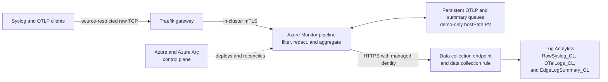
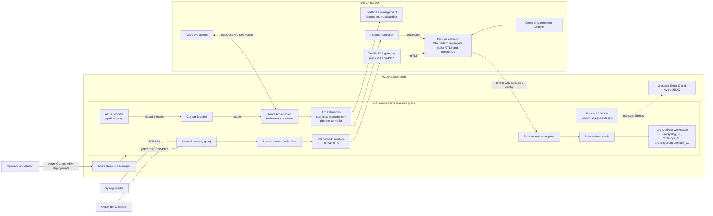
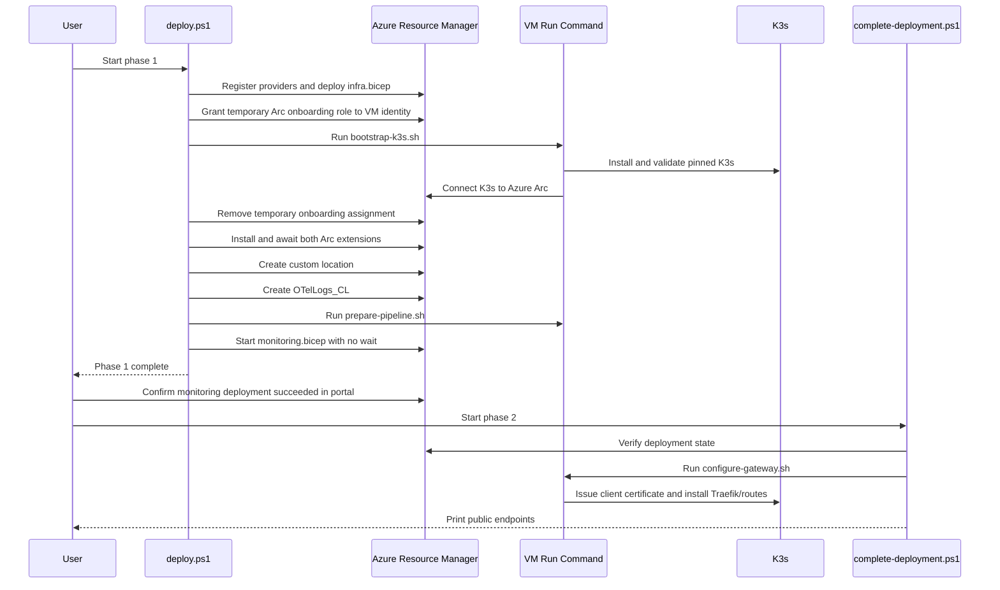

# Architecture

This page describes the complete architecture of the standalone Arc-enabled Azure Monitor pipeline demo. For deployment and validation commands, see [basic setup](basic-setup.md). For showcase installation, see [demo setup and operations](demo-setup.md). For the timed walkthrough, see the [12-minute demo guide](../README.md).

## Purpose and scope

The demo creates a single-node K3s cluster on an Azure virtual machine, projects that cluster into Azure through Azure Arc, and schedules an Azure Monitor pipeline onto it through a custom location. Two source-restricted public TCP endpoints accept raw Syslog TCP and OTLP gRPC traffic. An in-cluster Traefik gateway opens separate mutually authenticated TLS (mTLS) connections to the managed pipeline, which sends the records through an Azure Monitor data collection endpoint and data collection rule into Log Analytics.

This is an isolated demonstration environment, not a production reference architecture. It intentionally uses one VM, public ingestion endpoints, public Azure Monitor ingestion, and the preview OTLP log receiver. The Syslog pipeline scenario is generally available.

## Architecture at a glance

This is an edge-to-cloud telemetry path with an Azure-managed control plane. Azure Resource Manager defines the pipeline, Azure Arc and the custom location place it on K3s, and the pipeline extension reconciles the requested state inside the cluster. The data plane accepts both legacy Syslog and modern OTLP logs, normalizes or maps them into DCR streams, and exports them to one dedicated Log Analytics workspace.

The base configuration demonstrates:

- Central deployment and lifecycle management of an edge collector through Azure Arc.
- Syslog and preview OTLP log collection through one pipeline group.
- Source-restricted public ingress, an mTLS-protected in-cluster backend hop, and managed-identity export to Azure Monitor.
- Standard Syslog normalization with the `MicrosoftSyslog` processor and explicit OTLP field mapping.
- Repeatable infrastructure deployment plus marker-based end-to-end ingestion checks.

The additive showcase in `demo/showcase.bicep` keeps the same infrastructure and receiver ports, then updates the DCR and pipeline group in place. It filters low-value health/debug records, redacts fixed synthetic values, preserves richer OTLP context, fans Syslog into a one-minute aggregation path, and enables persistent queues for OTLP and Syslog summaries. Raw Syslog is non-persistent because extension `1.7.0` stalls that exporter when persistence is enabled. `setup-demo.ps1` creates the custom raw Syslog and summary tables and a single-node demo volume before applying that overlay. The pipeline's built-in Azure Monitor metrics provide CPU, memory, uptime, sent-record, and failed-record views; no custom workbook is required.

The base `monitoring.bicep` remains intentionally straight through. Deploying it again replaces the showcase pipeline configuration, after which `setup-demo.ps1` must be rerun.

## Detailed system topology

The arrows represent logical relationships. The public IP is attached directly to the VM network interface. K3s provides the implementation behind Traefik's `LoadBalancer` service on the single node; there is no separate Azure Load Balancer resource in the template.

## Azure resource plane

All resources are placed in one dedicated resource group and tagged with `workload=azure-monitor-pipeline-demo` and `environment=demo` where tags are supported. The prefix supplied to the deployment controls the resource names.

| Resource | Default name pattern | Responsibility |
| --- | --- | --- |
| Virtual network | `<prefix>-vnet` | Provides the `10.240.0.0/16` private address space. |
| K3s subnet | `k3s` | Uses `10.240.0.0/24` and carries the network security group. |
| Network security group | `<prefix>-nsg` | Allows inbound TCP/514 and TCP/4317 only from `AllowedSourceCidr`; all other unsolicited inbound traffic is denied by the default rules. |
| Public IP | `<prefix>-pip` | Provides a static Standard IPv4 address for the two demo endpoints. |
| Network interface | `<prefix>-nic` | Connects the VM at static private address `10.240.0.10` and associates the public IP. |
| Virtual machine | `<prefix>-k3s` | Runs Ubuntu 22.04, K3s, Arc agents, extensions, the pipeline, and Traefik. |
| Log Analytics workspace | `<prefix>-law` | Stores the base standard Syslog stream and the showcase custom raw Syslog, OTLP, and summary streams with 30-day retention. |
| Data collection endpoint | `<prefix>-dce` | Exposes the public Azure Monitor logs-ingestion endpoint used by the pipeline. |
| Arc-enabled Kubernetes | `<prefix>-k3s` | Azure control-plane representation of the K3s cluster. |
| Certificate extension | `azure-cert-management` | Creates and rotates the roots, issuers, and trust bundles used by the pipeline. |
| Pipeline extension | `azure-monitor-pipeline` | Runs the pipeline controller and owns the managed identity used to publish records. |
| Custom location | `<prefix>-monitor` | Maps Azure resource placement to the Arc cluster, pipeline extension, and `azure-monitor-pipeline` namespace. |
| Custom table | `OTelLogs_CL` | Stores OTLP log fields `TimeGenerated`, `Body`, and `SeverityText`. |
| Custom table | `RawSyslog_CL` | Stores normalized raw Syslog fields retained after showcase filtering and redaction. |
| Custom table | `EdgeLogSummary_CL` | Stores one-minute Syslog event counts before raw-event filtering. |
| Data collection rule | `<prefix>-pipeline-dcr` | Maps the pipeline streams to the workspace and their destination tables. |
| Pipeline group | `<prefix>-pipeline` | Declares receivers, processing, exporters, and the three log pipelines scheduled through the custom location. |

The VM uses a 64 GiB Premium SSD OS disk and defaults to `Standard_D4as_v5`. SSH key authentication is configured because Azure requires an administrator credential, but the network security group does not expose TCP/22. The Kubernetes API is also not published. Administrative guest actions use Azure VM Run Command.

## Kubernetes runtime plane

The VM hosts one K3s server and worker node. K3s is installed at the pinned version passed to `deploy.ps1`; the built-in Traefik installation is disabled so phase 2 can install the explicitly pinned chart. Host inotify limits are raised before Arc and pipeline workloads are installed.

The runtime is divided into these responsibilities:

- The `azure-arc` namespace contains the Arc agents that maintain the outbound connection to Azure and enable cluster-connect and custom-locations support.
- The certificate-management extension provides cert-manager integration, Azure Monitor root certificate Secrets, ClusterIssuers, and synchronized trust bundle ConfigMaps.
- The pipeline-controller extension uses the `azure-monitor-pipeline` namespace and reconciles the Azure `pipelineGroups` resource into an in-cluster pipeline workload and service.
- The managed pipeline service exposes TCP/514 and TCP/4317 inside the cluster. Its server certificate is rooted in the Azure Monitor trust bundle and it requires a trusted client identity.
- Traefik runs as a single replica in the same namespace. Label-scoped Kubernetes CRD discovery restricts it to the routes created for this demo.

The custom location is the bridge between Azure Resource Manager and this runtime. It references the Arc cluster as its host, associates the pipeline-controller extension, and selects `azure-monitor-pipeline` as its namespace. Deploying the pipeline group with that custom location causes the extension controller to materialize the pipeline on K3s.

## Deployment control flow

Deployment is deliberately split into two phases because creation of the pipeline group can remain in progress long enough to outlive a practical local polling loop.

### Phase 1: infrastructure, Arc, and pipeline submission

`deploy.ps1` performs the following ordered operations:

1. Validates inputs, selects the subscription, installs required Azure CLI extensions, and registers the required resource providers.
2. Creates or verifies the tagged resource group. An existing group without the standalone workload tag is rejected to prevent accidental reuse.
3. Deploys `infra.bicep`, producing the network, VM, workspace, and data collection endpoint.
4. Temporarily grants the VM's system-assigned identity `Kubernetes Cluster - Azure Arc Onboarding` at resource-group scope.
5. Runs `bootstrap-k3s.sh` through VM Run Command. The script installs K3s, Helm, Azure CLI, and the required CLI extensions; signs in with the VM identity; connects the cluster to Arc; enables cluster-connect and custom-locations; and verifies the Arc deployments and exact K3s version.
6. Removes the temporary role assignment in a `finally` block when the deployment created that assignment.
7. Installs and waits for the certificate-management and pipeline-controller Arc extensions.
8. Creates the custom location and waits for it to succeed.
9. Creates `OTelLogs_CL` through the Log Analytics tables REST API and waits for provisioning.
10. Runs `prepare-pipeline.sh` to label the namespace, wait for certificate roots and issuers, and verify synchronized trust bundles.
11. Starts `monitoring.bicep` asynchronously as `<prefix>-monitoring`, then returns control to the operator.

The script is restart-aware for the Arc connection, extensions, custom location, table, and certificate preparation. A failed or canceled custom location is deleted before it is recreated.

### Portal gate

The operator waits for the `<prefix>-monitoring` resource-group deployment to reach `Succeeded`. This deployment creates the DCR, grants the pipeline extension identity access to that DCR, and creates the pipeline group. The explicit gate prevents gateway configuration from racing the controller-created service and endpoints.

### Phase 2: gateway publication

`complete-deployment.ps1` does not poll. It first requires the monitoring deployment to have already succeeded, then runs `configure-gateway.sh` through VM Run Command. That script:

1. Verifies the pipeline trust bundle and waits for the controller-created service to expose ready ports 514 and 4317.
2. Requests a 48-hour ECDSA client certificate, renewed 24 hours before expiry, from the Azure Monitor client-root ClusterIssuer.
3. Installs the pinned Traefik CRDs and creates one `ServersTransportTCP` plus separate Syslog and OTLP `IngressRouteTCP` resources.
4. Configures backend TLS with hostname verification, the synchronized server root CA, and the generated client certificate. `insecureSkipVerify` is disabled.
5. Installs the pinned Traefik chart with only TCP/514 and TCP/4317 exposed and waits for the deployment to become available.

Phase 2 is idempotent: Kubernetes resources are applied declaratively and Helm uses `upgrade --install`.

## Identity, authorization, and trust

Three identity contexts have different responsibilities.

| Identity | Scope and lifetime | Use |
| --- | --- | --- |
| Operator's Azure CLI identity | Subscription and resource group; deployment time | Creates the resource group, resources, extensions, custom location, table, and role assignments. |
| VM system-assigned managed identity | VM lifetime; onboarding elevation is temporary | Authenticates from the guest to create or repair the Arc connection. The deployment removes the onboarding assignment it creates even when bootstrap fails. |
| Pipeline extension managed identity | Extension lifetime; DCR scope | Receives `Monitoring Metrics Publisher` on the DCR and authenticates pipeline export to Azure Monitor. |

The Custom Locations service principal object ID is resolved in the tenant and supplied during Arc onboarding so the feature can establish its required Kubernetes authorization. No long-lived service-principal secret is created by this package.

Transport trust is separate from Azure RBAC. The certificate extension maintains the Azure Monitor certificate hierarchy. Namespace labels request server and client trust bundles. Traefik presents a short-lived client certificate to the pipeline, validates the pipeline service certificate against `arc-amp-trust-bundle`, and checks the service's cluster DNS name.

The certificate-management extension can create base root CA Secrets before it creates the active `-current` aliases expected by its ClusterIssuers. `prepare-pipeline.sh` includes an idempotent compatibility step that creates the missing aliases in-cluster without printing certificate or key material.

## Telemetry data flow

### Syslog

1. A permitted source opens a TCP connection to `<public-ip>:514` and sends an RFC-compatible Syslog message.
2. The subnet NSG admits the connection only when its source matches `AllowedSourceCidr`.
3. The VM public IP and K3s service path deliver the raw TCP stream to Traefik.
4. Traefik selects the Syslog TCP route and establishes an mTLS connection to `<prefix>-pipeline-service:514`.
5. The pipeline's Syslog receiver parses the input and the `MicrosoftSyslog` processor normalizes its fields.
6. In the base configuration, the exporter maps those attributes to `Microsoft-Syslog-FullyFormed`, and the DCR writes them to the standard `Syslog` table.
7. The additive showcase filters and redacts the normalized records, maps them to `Custom-RawSyslog`, and writes retained raw records to `RawSyslog_CL`. A parallel pre-filter branch writes one-minute counts to `EdgeLogSummary_CL`.

### OTLP logs

1. A permitted source opens a gRPC connection to `<public-ip>:4317` and exports OTLP log records.
2. The NSG and Traefik carry the TCP stream to the pipeline's OTLP receiver over the same mTLS-protected backend pattern.
3. The exporter maps `severity_text`, `body`, and `time_unix_nano` to `SeverityText`, `Body`, and `TimeGenerated` in the declared `Custom-OTLP` stream.
4. The DCR maps `Custom-OTLP` to `Custom-OTelLogs_CL`, which lands in `OTelLogs_CL`.

Both routes share the data collection endpoint, DCR, workspace, pipeline extension identity, and in-cluster pipeline service. They differ at the receiver, optional processing, schema mapping, and destination table.

## Network and security boundaries

- Only TCP/514 and TCP/4317 are explicitly admitted, and only from `AllowedSourceCidr`.
- SSH, the Kubernetes API, Traefik web entry points, and the Traefik dashboard are not exposed publicly.
- VM administration and script transfer use authenticated Azure VM Run Command through the Azure control plane.
- Arc agents initiate outbound connectivity; no inbound Arc management port is opened.
- The public client-to-Traefik hop is raw protocol transport. The protected mTLS boundary is the Traefik-to-pipeline hop inside K3s.
- The Log Analytics workspace permits public ingestion and query, and the DCE permits public network access. Private Link is outside this demo's scope.
- The single CIDR allowlist is the only network-level sender authorization. The demo does not configure application-layer client authentication on its public endpoints.
- The VM, K3s node, gateway, and pipeline are a single failure domain. There is no node redundancy, availability-zone design, autoscaling, or disaster-recovery path.

## Operations and lifecycle

`validate.ps1` verifies the base deployments, Arc connectivity, the exact K3s version, both extensions, the custom location, DCR, pipeline group, custom table, workspace, and TCP reachability of both public endpoints. The additive `test-demo-readiness.ps1` verifies showcase markers independently in `RawSyslog_CL`, `OTelLogs_CL`, and `EdgeLogSummary_CL`.

Certificate renewal is handled by cert-manager according to the certificate resource. Extension and chart versions remain operational dependencies: K3s is explicitly pinned, Traefik is explicitly pinned, and the Arc extensions use automatic minor-version upgrades. Because the OTLP path remains in preview and extension behavior can change across versions, version changes should be validated end to end before reuse.

`cleanup.ps1` deletes the entire resource group, but only after confirming its standalone workload tag. Deleting the group removes the Azure resources, VM-hosted cluster, Arc projection, telemetry workspace, and role assignments together. Log Analytics data is not retained after workspace deletion.

## Source map

| File | Architectural responsibility |
| --- | --- |
| [`infra.bicep`](../infra.bicep) | Network, VM, managed identity, workspace, and data collection endpoint. |
| [`monitoring.bicep`](../monitoring.bicep) | DCR, extension-identity role assignment, receivers, processors, exporters, and pipeline group. |
| [`deploy.ps1`](../deploy.ps1) | Phase 1 orchestration, provider registration, temporary RBAC, extension/custom-location setup, custom table creation, and asynchronous pipeline submission. |
| [`bootstrap-k3s.sh`](../bootstrap-k3s.sh) | Guest provisioning, K3s installation, Arc connection, feature enablement, and readiness checks. |
| [`prepare-pipeline.sh`](../prepare-pipeline.sh) | Namespace trust opt-in, certificate readiness, compatibility aliasing, and trust-bundle checks. |
| [`complete-deployment.ps1`](../complete-deployment.ps1) | Portal-gate enforcement and phase 2 VM Run Command orchestration. |
| [`configure-gateway.sh`](../configure-gateway.sh) | Client certificate, mTLS backend transport, TCP routes, and Traefik Helm release. |
| [`validate.ps1`](../validate.ps1) | Resource-state and endpoint validation. |
| [`send-syslog-demo.ps1`](../send-syslog-demo.ps1) | Marker-based Syslog test traffic. |
| [`send-otlp-demo.ps1`](../send-otlp-demo.ps1) | Marker-based OTLP log test traffic. |
| [`cleanup.ps1`](../cleanup.ps1) | Tag-guarded resource-group deletion. |
