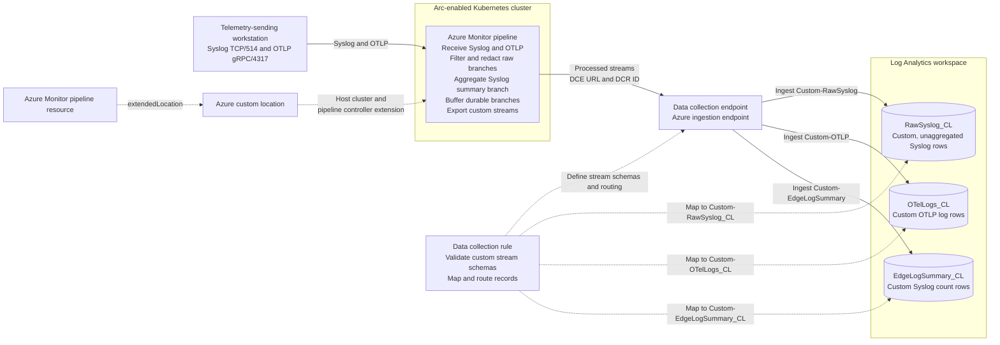

# Azure Monitor pipeline data-flow demo guide

## What this demo is about

Imagine a company with factories, hospitals, retail stores, or remote offices. Each site has older infrastructure that emits Syslog and newer applications that emit OpenTelemetry (OTLP). Sending every raw event directly across the WAN creates several problems:

- Every site needs separately managed collection software and configuration.
- Repetitive health messages consume bandwidth and paid ingestion without adding much investigative value.
- Sensitive values can leave the site before a central team has a chance to remove them.
- A WAN or Azure endpoint interruption can create a telemetry gap.
- Operators need to know whether silence means a quiet source, a broken receiver, or a failed export.

This demo represents one of those sites. Azure holds the centrally governed pipeline definition. Azure Arc carries that desired state to a collector running on Kubernetes at the site. The collector accepts both Syslog and OTLP, processes records before they leave the site, and exports the useful result to Azure Monitor through managed identity.

The point is not merely that logs arrive in Log Analytics. The demo shows that the edge pipeline can make deliberate decisions about telemetry before transmission:

1. **Unify old and new sources.** Network devices and appliances continue using Syslog while modern applications use OTLP.
2. **Reduce noise and cost.** Low-value health and debug records are removed before WAN transfer and ingestion.
3. **Minimize sensitive data.** Synthetic email and token values are redacted at the site rather than after storage.
4. **Preserve trends without every raw event.** Repeated Syslog records become one-minute counts with useful dimensions.
5. **Survive a temporary cloud-path failure.** Persistent queues retain OTLP records and Syslog summaries, then drain after connectivity returns; raw Syslog resumes after restoration.
6. **Operate centrally.** Azure manages the pipeline configuration and exposes health metrics even though collection runs outside Azure.

This is a scale-model of a distributed design: the demo deploys one single-node K3s site, while a real organization could apply the pattern to many Arc-enabled locations. Its public raw-protocol endpoints and local `hostPath` storage are demonstration choices, not a production reference architecture.

## End-to-end data flow



Filtering, redaction, aggregation, and persistent buffering happen in the **Azure Monitor pipeline running on the Arc-enabled Kubernetes cluster**. The DCE is the Azure ingestion endpoint. The DCR is configuration, not a network endpoint: it validates the exported stream schemas and routes each stream to its Log Analytics table. It does not perform this demo's edge filtering, redaction, or aggregation.

The Arc-enabled Kubernetes cluster is not a data source. The workstation is the source because it sends Syslog and OTLP to the pipeline receivers. The cluster is the pipeline's execution location. The association is a placement chain: the `microsoft.monitor.pipelinecontroller` extension is installed on the Arc-connected cluster, the custom location references that cluster and extension, and the pipeline resource's `extendedLocation` references the custom location. That is why the pipeline's dataflows and DCR do not list the cluster as a source.

In an Azure portal creation flow, select this relationship on **Basics** using **Cluster name** and **Custom location**. It is not configured on **Dataflows** or in the DCR. For this Bicep-deployed showcase, open the pipeline **Overview** and inspect its **Custom location**, then open that custom location to follow its host-resource relationship to the Arc-enabled cluster. The solid arrows in the diagram are telemetry flow; the placement text and dotted DCR arrows describe control-plane relationships.

## Real-world scenario map

| Situation | Problem shown | What to demonstrate | Operational value |
| --- | --- | --- | --- |
| Hybrid data center modernization | Syslog appliances and OTLP applications coexist for years | Both receivers process one continuous, correlated run | Modernize telemetry without a flag-day source migration |
| Retail branch or factory | WAN links and central ingestion are costly | Filtering and one-minute aggregation happen before export | Send fewer low-value records while retaining volume trends |
| Hospital or regulated site | Raw messages may contain identifiers or credentials | Fixed synthetic values become redaction markers before arrival | Reduce data exposure and support data-minimization controls |
| Remote office, mine, or vessel | Connectivity to Azure can be intermittent | Block the DCE path, keep sending, restore it, and query recovered sequences | Avoid an immediate telemetry gap during a short outage |
| Central operations team | Distributed collectors drift and are difficult to troubleshoot | Show Arc reconciliation, declarative configuration, and pipeline metrics | Govern and observe edge collection from Azure |

The audience should leave understanding the boundary: source systems send locally, the pipeline decides what is worth transmitting, and Azure Monitor remains the central analytics and operations destination.

This guide assumes the operator has completed the [demo setup and readiness check](demo-setup.md). The showcase includes continuous Syslog and OTLP traffic, edge filtering and redaction, one-minute aggregation, persistent buffering for OTLP and summaries, and built-in pipeline health metrics.

## Existing deployment or new deployment?

You do not need to start over when the repository's base infrastructure is already deployed. Do not rerun `deploy.ps1` or `complete-deployment.ps1` merely to add the showcase. Run the additive setup against the existing resource group and prefix, then run readiness:

```powershell
& .\setup-demo.ps1 `
   -SubscriptionId '<subscription-id>' `
   -ResourceGroupName '<existing-resource-group>' `
   -NamePrefix '<existing-prefix>'

& .\test-demo-readiness.ps1 `
   -SubscriptionId '<subscription-id>' `
   -ResourceGroupName '<existing-resource-group>' `
   -NamePrefix '<existing-prefix>'
```

Only use the base deployment steps in the README when the VM, Arc-enabled cluster, workspace, DCE, pipeline group, and gateway do not already exist.

## Presenter preparation

Complete this checklist before the audience joins.

1. Confirm the base environment exists and its K3s VM is running, or deploy it by following the [README](../README.md) when starting with an empty resource group. Starting a deallocated VM resumes the existing environment; it does not require redeployment.
2. Install the additive showcase by following [demo setup and operations](demo-setup.md). Re-run setup after pulling changes to its storage preparation.
3. Run the full readiness check:

   ```powershell
   & .\test-demo-readiness.ps1 `
       -SubscriptionId '<subscription-id>' `
       -ResourceGroupName 'rg-arc-monitor-demo' `
       -NamePrefix 'arcmon'
   ```

4. Retrieve the public endpoint:

   ```powershell
   $endpoint = az network public-ip show `
       --subscription '<subscription-id>' `
       --resource-group 'rg-arc-monitor-demo' `
       --name 'arcmon-pip' `
       --query ipAddress `
       --output tsv
   ```

5. Choose a fresh run ID and stage the presentation command:

   ```powershell
   $runId = 'DEMO-20260919-01'
   & .\run-demo.ps1 `
       -Endpoint $endpoint `
       -EventsPerSecond 5 `
       -RunId $runId `
       -ShowPayloadSample
   ```

6. Verify the readiness script's `PREFLIGHT-...` run in Log Analytics.
7. Open and arrange these views before presenting:
   - This guide at **End-to-end data flow**.
   - **Azure Monitor** > **Pipelines** > `<prefix>-pipeline`.
   - The pipeline's **Dataflows** configuration.
   - The Arc-enabled Kubernetes resource and its Extensions page.
   - Log Analytics Logs with saved Syslog and OTLP queries.
   - The pipeline's **Monitoring** > **Metrics** page.
8. Start the bounded generator before the live query segment and confirm that data is arriving.
9. Run `test-demo-recovery.ps1` on the same deployed version. Keep the restore command ready in a separate terminal during the presentation.
10. Use the staged run ID in every query and chart.

## Evidence model for the standard run

The rest of this guide is organized by feature. Every feature identifies where its configuration is visible, what effect it should have, and where to verify that effect.

Keep the generator terminal visible and use its run ID in every query. The sender's final JSON line is the source of truth for how many Syslog and OTLP events were sent.

The normal command output contains status and counters, not every event body. `-ShowPayloadSample` adds one `source-sample` JSON line for retained sequence 3. It displays the exact pre-pipeline Syslog wire message and OTLP body, including the synthetic plaintext `demo.user@example.com` and `demo-token-123`. It does not print every event or any real secret.

| Evidence | Meaning | Expected after ingestion settles |
| --- | --- | --- |
| Syslog events sent | Messages written by the workstation sender to the Syslog connection | Final sender `counts.syslog` |
| OTLP events sent | Log records handed by the workstation sender to the OTLP exporter | Final sender `counts.otlp` |
| Raw Syslog records retained | Source messages that pass the health/debug filter and become individual `RawSyslog_CL` rows | `transaction + warning + error` from the final sender counts |
| OTLP records retained | Source records that pass the health/debug filter and become individual `OTelLogs_CL` rows | `transaction + warning + error` from the final sender counts |
| Syslog source events represented in summaries | Source messages counted inside `EdgeLogSummary_CL.EventCount`; this is an event total, not a row count | `sum(EventCount)` equals final `counts.syslog` |
| Unredacted synthetic values stored | Rows containing the original email or token | 0 |

Here, **retained** means that an event survives the pipeline filter and is stored as one unaggregated row in its raw destination table. It does not mean unchanged: retained rows are redacted before export. A filtered event is not retained in `RawSyslog_CL` or `OTelLogs_CL`, but the Syslog event is still represented numerically in the pre-filter summary branch. One summary row can represent many source messages, so the number of `EdgeLogSummary_CL` rows is not expected to equal the number sent.

The generator repeats a ten-event pattern. Five health/debug events are filtered and five transaction/warning/error events are retained. Each retained event contains both synthetic sensitive values, so both redaction-marker counts should equal the retained count. **Ingestion settles** when pipeline batches and any queued exports have drained and the Log Analytics queries return the expected totals. The readiness and recovery scripts calculate exact expectations from the final sender counts.

## Log Analytics table schemas

All three tables are **custom Log Analytics tables** created for this demo. Their `_CL` suffix means custom log. `RawSyslog_CL` is custom even though its columns resemble the built-in `Syslog` table. In this guide, **raw** means one row per retained source event rather than an aggregate; it does not mean unfiltered or unredacted. The tables below list every column provisioned by `setup-demo.ps1`; the Logs experience can additionally expose Azure-managed metadata columns that are not populated by the pipeline and are not part of this demo's stream contract.

The pipeline exports three custom stream payloads to the DCE. The DCR declares each stream schema, validates incoming fields, applies its table mapping, and routes the resulting row to the workspace.

### `RawSyslog_CL`

The pipeline exports `Custom-RawSyslog` with `TimeGenerated`, `Body`, and `SeverityText`. The DCR expands those fields into this Syslog-shaped custom table. Fields that the demo does not populate are intentionally empty or null.

| Column | Type | Meaning in this demo |
| --- | --- | --- |
| `TimeGenerated` | datetime | Event timestamp supplied by the normalized Syslog record |
| `CollectorHostName` | string | Reserved collector field; empty in this demo |
| `Computer` | string | Reserved computer field; empty in this demo |
| `EventTime` | datetime | Copy of `TimeGenerated` created by the DCR mapping |
| `Facility` | string | Reserved Syslog facility field; empty in the custom mapping |
| `HostIP` | string | Reserved source-IP field; empty in the custom mapping |
| `HostName` | string | Reserved source-host field; empty in the custom mapping |
| `ProcessID` | int | Reserved process identifier; null in the custom mapping |
| `ProcessName` | string | Reserved process-name field; empty in the custom mapping |
| `SeverityLevel` | string | Severity normalized by the pipeline's Microsoft Syslog processor, such as `informational`, `warning`, or `error` |
| `SourceSystem` | string | Constant `Azure` assigned by the DCR mapping |
| `SyslogMessage` | string | Retained message body after filtering and redaction |

### `OTelLogs_CL`

The pipeline exports `Custom-OTLP`, and the DCR maps it directly into this table without another content transformation.

| Column | Type | Meaning in this demo |
| --- | --- | --- |
| `TimeGenerated` | datetime | OTLP log-record timestamp |
| `Body` | string | OTLP log body after filtering and redaction |
| `SeverityText` | string | OTLP severity text: `INFO`, `WARNING`, or `ERROR` for retained rows |
| `DemoRunId` | string | Correlation identifier shared by both protocols |
| `SequenceNumber` | long | Monotonically increasing event number within the run |
| `ServiceName` | string | Synthetic emitting service, `checkout-api` |
| `DeploymentEnvironment` | string | Synthetic environment, `demo` |
| `Site` | string | Synthetic site, `edge-01` |
| `TraceId` | string | Deterministic trace identifier for the run and sequence |
| `DurationMs` | real | Synthetic operation duration in milliseconds |
| `EventClass` | string | `transaction`, `warning`, or `error` for retained rows |

### `EdgeLogSummary_CL`

The pipeline creates `Custom-EdgeLogSummary` from the Syslog branch before raw filtering. It removes the message body and stores only grouped counts.

| Column | Type | Meaning in this demo |
| --- | --- | --- |
| `TimeGenerated` | datetime | Source event time rounded down to a one-minute bucket |
| `DemoRunId` | string | Run ID extracted from the Syslog message |
| `Site` | string | Site extracted from the Syslog message |
| `SeverityLevel` | string | Normalized Syslog severity used as a grouping dimension |
| `EventCount` | long | Number of source Syslog events represented by this summary row |

### Portal navigation used in this guide

In the Azure portal, search for and open **Azure Monitor**, select **Pipelines**, and then select `<prefix>-pipeline`. This is the primary presentation surface. Use its **Dataflows** experience to explain each source, listening port, transformation, destination workspace, and destination table. Use **Monitoring** > **Metrics** for pipeline health and the Log Analytics workspace **Logs** page for the resulting records.

This showcase was deployed from Bicep because it uses advanced configuration beyond the portal's guided creation experience. The portal can present the pipeline and its logical dataflows, but the current guided UI doesn't expose every advanced setting, including the persistent-volume name, exporter queue limits, custom record maps, or a custom batch interval. Do not open **JSON View** during the normal demo. Prove those advanced behaviors with the readiness and recovery checks below; use the Bicep definition only as optional engineering follow-up.

## Feature-oriented run of show

### Feature 1: Unify old and new sources

**Where the feature is set up:** In **Azure Monitor** > **Pipelines** > `<prefix>-pipeline`, open **Dataflows**. Show the Syslog source on TCP/514 and the OTLP source on TCP/4317. Follow each visual dataflow to the `<prefix>-law` Log Analytics workspace and its destination table: `RawSyslog_CL`, `OTelLogs_CL`, or `EdgeLogSummary_CL`.

**Expected telemetry effect:** The same run ID appears through both protocols. After filtering, each raw table retains five events per complete ten-event pattern. OTLP rows also retain sequence, service, site, trace, duration, and event-class fields.

**Concrete before and after:** Sequence 3 is a retained informational transaction on both inputs. Timestamps and the deterministic trace ID vary with the run.

| Stage | Representative record |
| --- | --- |
| Syslog before the pipeline | `<14>1 <timestamp> demo-sender arc-monitor-demo 3 DEMO - run_id=DEMO-20260919-01 sequence=3 site=edge-01 environment=demo event_class=transaction severity=INFO duration_ms=131 trace_id=<trace-id> email=demo.user@example.com token=demo-token-123` |
| `RawSyslog_CL` after processing | `TimeGenerated=<timestamp>`, `SeverityLevel=informational`, `SourceSystem=Azure`, `SyslogMessage=...run_id=DEMO-20260919-01 sequence=3...email=[REDACTED_EMAIL] token=[REDACTED_TOKEN]` |
| OTLP before the pipeline | Body `run_id=DEMO-20260919-01 sequence=3 event_class=transaction email=demo.user@example.com token=demo-token-123`; attributes include `DemoRunId`, `SequenceNumber=3`, `ServiceName=checkout-api`, `Site=edge-01`, `TraceId`, `DurationMs=131`, and `EventClass=transaction` |
| `OTelLogs_CL` after processing | The same mapped attributes occupy typed columns; `SeverityText=INFO` and the stored `Body` contains both redaction markers |

This is a schema conversion as well as a transport demonstration: the Syslog wire format becomes a Syslog-shaped custom row, while OTLP structured attributes become dedicated custom columns.

**How and where to check:** In the Log Analytics workspace, open **Logs**, set the time picker to include the current run, and run:

```kusto
let RunId = "DEMO-20260919-01";
union
(
   RawSyslog_CL
   | where SyslogMessage contains RunId
   | summarize Records=count()
   | extend Path="Syslog TCP/514"
),
(
   OTelLogs_CL
   | where DemoRunId == RunId
   | summarize Records=count()
   | extend Path="OTLP gRPC/4317"
)
| project Path, Records
```

Then open representative OTLP records to show the mapped fields:

```kusto
let RunId = "DEMO-20260919-01";
OTelLogs_CL
| where DemoRunId == RunId
| project TimeGenerated, SequenceNumber, SeverityText, EventClass, ServiceName, Site, TraceId, DurationMs, Body
| order by SequenceNumber desc
| take 10
```

**Say:** One Azure-managed edge pipeline accepts a legacy protocol and a modern observability protocol, then sends each to its intended Azure Monitor table.

### Feature 2: Reduce noise and cost

**Where the feature is set up:** In **Azure Monitor** > **Pipelines** > `<prefix>-pipeline` > **Dataflows**, open the raw Syslog dataflow and its data transformation, then do the same for the OTLP dataflow. Show the `where` clauses that remove Syslog `event_class=health` and debug severity, and OTLP health bodies and `DEBUG` severity. The visual dataflow places each transformation between its source and Log Analytics destination.

**Expected telemetry effect:** Five of every ten generated events are health/debug records and must be absent from both raw tables. Each raw table therefore retains five events per complete ten-event pattern, with zero retained health or debug records.

**Concrete before and after:** Sequence 1 is generated as `event_class=health` with `DEBUG` severity. The Syslog message contains `sequence=1 ... event_class=health severity=DEBUG`, and the equivalent OTLP record has `SequenceNumber=1`, `EventClass=health`, and `SeverityText=DEBUG`. After processing, there is no sequence-1 row in either raw destination. The Syslog summary branch runs before this filter, so sequence 1 still contributes to a `SeverityLevel=debug` summary count.

| Source pattern | Raw Syslog result | OTLP result | Syslog summary result |
| --- | --- | --- | --- |
| Sequences 1, 2, 4, 6, and 8: health/debug | No stored raw row | No stored OTLP row | Included in `EventCount` |
| Sequences 3, 5, and 7: transaction/informational | One stored row per event | One stored row per event | Included in `EventCount` |
| Sequence 9: warning; sequence 10: error | One stored row per event | One stored row per event | Included in `EventCount` |

**How and where to check:** In Log Analytics **Logs**, run:

```kusto
let RunId = "DEMO-20260919-01";
union
(
   RawSyslog_CL
   | where SyslogMessage contains RunId
   | summarize Retained=count(),
            HealthRecords=countif(SyslogMessage contains "event_class=health"),
            DebugRecords=countif(tolower(SeverityLevel) == "debug")
   | extend Path="Syslog"
),
(
   OTelLogs_CL
   | where DemoRunId == RunId
   | summarize Retained=count(),
            HealthRecords=countif(EventClass == "health"),
            DebugRecords=countif(SeverityText == "DEBUG")
   | extend Path="OTLP"
)
| project Path, Retained, HealthRecords, DebugRecords
```

**Expected result:** `Retained` matches five events per complete ten-event pattern; `HealthRecords=0` and `DebugRecords=0` for both paths.

**Say:** The edge pipeline removes low-value records before they cross the WAN or consume Log Analytics ingestion.

### Feature 3: Minimize sensitive data

**Where the feature is set up:** Keep **Azure Monitor** > **Pipelines** > `<prefix>-pipeline` > **Dataflows** open. In the raw Syslog and OTLP transformation editors, show the `replace_string` expressions that replace `demo.user@example.com` and `demo-token-123` with `[REDACTED_EMAIL]` and `[REDACTED_TOKEN]`.

**Expected telemetry effect:** No retained row contains either original synthetic value. Every retained row contains both redaction markers, so each marker count equals the retained count in each raw table.

**Concrete before and after:** The source sample and stored sequence-3 records make the transformation visible without exposing real sensitive data.

| Field | Before edge processing | Stored in Log Analytics |
| --- | --- | --- |
| Syslog message fragment | `email=demo.user@example.com token=demo-token-123` | `SyslogMessage` contains `email=[REDACTED_EMAIL] token=[REDACTED_TOKEN]` |
| OTLP body fragment | `email=demo.user@example.com token=demo-token-123` | `Body` contains `email=[REDACTED_EMAIL] token=[REDACTED_TOKEN]` |
| Structured OTLP fields | `DemoRunId`, `SequenceNumber`, `ServiceName`, `Site`, `TraceId`, `DurationMs`, `EventClass` | Preserved in their `OTelLogs_CL` columns |

Redaction changes only the two message-body values. It does not hash them, retain a hidden original, or alter the structured correlation columns.

**How and where to check:** First show the generator terminal's `source-sample` line. Sequence 3 contains `email=demo.user@example.com` in both `syslogWireMessage` and `otlpBody`; this is the plaintext source before edge processing. Then, in the Azure portal, open the Log Analytics workspace **Logs** blade and query that exact run and sequence:

```kusto
let RunId = "DEMO-20260919-01";
union
(
   RawSyslog_CL
   | where SyslogMessage contains RunId and SyslogMessage contains "sequence=3 "
   | project Path="Syslog", StoredBody=SyslogMessage
),
(
   OTelLogs_CL
   | where DemoRunId == RunId and SequenceNumber == 3
   | project Path="OTLP", StoredBody=Body
)
```

The two stored rows should contain `email=[REDACTED_EMAIL]` and `token=[REDACTED_TOKEN]`. Next run the aggregate leak check:

```kusto
let RunId = "DEMO-20260919-01";
union
(
   RawSyslog_CL
   | where SyslogMessage contains RunId
   | summarize Retained=count(),
            UnredactedValues=countif(SyslogMessage contains "demo.user@example.com" or SyslogMessage contains "demo-token-123"),
            RedactedEmails=countif(SyslogMessage contains "[REDACTED_EMAIL]"),
            RedactedTokens=countif(SyslogMessage contains "[REDACTED_TOKEN]")
   | extend Path="Syslog"
),
(
   OTelLogs_CL
   | where DemoRunId == RunId
   | summarize Retained=count(),
            UnredactedValues=countif(Body contains "demo.user@example.com" or Body contains "demo-token-123"),
            RedactedEmails=countif(Body contains "[REDACTED_EMAIL]"),
            RedactedTokens=countif(Body contains "[REDACTED_TOKEN]")
   | extend Path="OTLP"
)
| project Path, Retained, UnredactedValues, RedactedEmails, RedactedTokens
```

**Expected result:** `UnredactedValues=0`; both marker columns equal `Retained` for each path.

**Say:** Sensitive values are changed at the site. Azure Monitor receives the minimized form rather than storing the original values first.

### Feature 4: Preserve trends without every raw event

**Where the feature is set up:** In **Azure Monitor** > **Pipelines** > `<prefix>-pipeline` > **Dataflows**, open the Syslog summary dataflow whose destination is `EdgeLogSummary_CL`. Show its aggregation transformation, which groups by minute, run ID, site, and severity. This parallel branch receives the Syslog source before the raw dataflow's filter. The one-minute batch interval is advanced Bicep configuration and isn't editable in the current portal experience.

**Expected telemetry effect:** Summary rows represent all Syslog source events, including health/debug events removed from `RawSyslog_CL`. `sum(EventCount)` equals the final Syslog sent count while the raw table retains five events per complete ten-event pattern. Per complete pattern, the summaries represent five debug, three informational, one warning, and one error event.

**Concrete before and after:** If one complete ten-event pattern falls within one clock minute, the source has ten separate Syslog messages. The raw branch stores only sequences 3, 5, 7, 9, and 10. The summary branch stores rows like these instead of message bodies:

| `TimeGenerated` minute | `DemoRunId` | `Site` | `SeverityLevel` | `EventCount` |
| --- | --- | --- | --- | --- |
| `<minute>:00Z` | `DEMO-20260919-01` | `edge-01` | `debug` | 5 |
| `<minute>:00Z` | `DEMO-20260919-01` | `edge-01` | `informational` | 3 |
| `<minute>:00Z` | `DEMO-20260919-01` | `edge-01` | `warning` | 1 |
| `<minute>:00Z` | `DEMO-20260919-01` | `edge-01` | `error` | 1 |

If the pattern crosses a minute or export-batch boundary, more rows can be emitted. Re-summarizing by minute, site, and severity produces the same totals. The before/after schema change is deliberate: detailed `SyslogMessage` content becomes the dimensional columns plus `EventCount`.

**How and where to check:** In Log Analytics **Logs**, first prove the total reduction:

```kusto
let RunId = "DEMO-20260919-01";
let RawRetained = toscalar(
   RawSyslog_CL
   | where SyslogMessage contains RunId
   | count
);
EdgeLogSummary_CL
| where DemoRunId == RunId
| summarize SummarySourceEvents=sum(EventCount)
| extend RawRetained
| project RawRetained, SummarySourceEvents
```

Then show the one-minute rollups:

```kusto
let RunId = "DEMO-20260919-01";
EdgeLogSummary_CL
| where DemoRunId == RunId
| summarize Events=sum(EventCount) by bin(TimeGenerated, 1m), Site, SeverityLevel
| order by TimeGenerated asc
```

**Expected result:** `RawRetained` matches five events per complete ten-event pattern, and `SummarySourceEvents` equals the sender's final Syslog count. Multiple minute/severity rows are expected; re-aggregation is intentional because a batch can emit more than one summary row for the same clock minute.

**Say:** The raw branch saves ingestion by dropping repetitive detail, while the parallel summary branch preserves the operational trend and the count of filtered events.

### Feature 5: Survive a temporary cloud-path failure

**Where the feature is set up:** In **Azure Monitor** > **Pipelines** > `<prefix>-pipeline` > **Dataflows**, identify the two durable branches by their destinations: `OTelLogs_CL` and `EdgeLogSummary_CL`. Persistent-volume and per-exporter queue settings are advanced Bicep configuration and aren't exposed by the current guided portal UI, so use the recovery harness as the live proof. State the boundary clearly: `RawSyslog_CL` is intentionally nonpersistent because extension `1.7.0` stalls that exporter when persistence is enabled.

**Expected telemetry effect:** During a temporary DCE-path interruption, OTLP records and Syslog summaries queue locally and drain after restoration. The recovery run must retain every expected filtered OTLP sequence and every summarized Syslog source event. Raw Syslog is not lossless during the interruption; it must resume after restoration.

**Concrete before and after:** The outage changes delivery timing, not the durable table schemas or record content.

| Event at the pipeline | While the DCE path is blocked | After restoration |
| --- | --- | --- |
| Retained OTLP transaction with `SequenceNumber=<N>` | Serialized in the OTLP exporter's persistent queue; no new workspace row yet | One normal `OTelLogs_CL` row appears with the original event `TimeGenerated`, sequence, attributes, and redacted `Body` |
| Syslog events in a minute/severity group | Their aggregate is serialized in the summary exporter's persistent queue | Normal `EdgeLogSummary_CL` rows arrive; `sum(EventCount)` covers the events sent during the interruption |
| Retained raw Syslog message | No persistent-queue guarantee; it can be absent from the workspace | New post-restoration messages again appear as normal `RawSyslog_CL` rows |

`TimeGenerated` remains the event or bucket time, so an individual durable row does not carry an explicit “was queued” flag. Exact sequence coverage and summary totals from the recovery harness are the evidence that delayed records drained. The raw branch is verified only for resumed post-restoration flow.

**How and where to check:** Run the complete recovery harness rather than manually issuing separate block and restore commands:

```powershell
& .\test-demo-recovery.ps1 `
   -SubscriptionId '<subscription-id>' `
   -ResourceGroupName 'rg-arc-monitor-demo' `
   -NamePrefix 'arcmon' `
   -EventsPerSecond 2
```

The script restores the route in a `finally` block and queries Log Analytics until it can test all phases. Its success line is the primary evidence:

```text
[PASS] Persistent recovery: OTLP retained all <retained> filtered records across the outage, the summary retained all <sent> source events, and raw Syslog resumed after restoration for <run-id>.
```

For an audience drill-down, use the printed recovery run ID:

```kusto
let RunId = "RECOVERY-...";
OTelLogs_CL
| where DemoRunId == RunId
| summarize Retained=count(), DistinctSequences=dcount(SequenceNumber), First=min(TimeGenerated), Last=max(TimeGenerated)
```

```kusto
let RunId = "RECOVERY-...";
EdgeLogSummary_CL
| where DemoRunId == RunId
| summarize SourceEvents=sum(EventCount), First=min(TimeGenerated), Last=max(TimeGenerated)
```

**Say:** The durable branches preserve their exact expected evidence during the rehearsed outage and drain it after recovery. Raw Syslog has the narrower guarantee that live flow resumes.

### Feature 6: Operate centrally

**Where the feature is set up:** In the Azure portal, open **Azure Monitor** > **Pipelines** > `<prefix>-pipeline`. Use **Dataflows** to show the centrally managed Syslog, OTLP, and summary paths. Then select **Monitoring** > **Metrics** to show that Azure monitors the pipeline running on the Arc-enabled cluster.

**Expected telemetry effect:** The Azure-managed definition controls what the remote pipeline receives, processes, and exports. During steady traffic, exported log records increase while failed-export records remain at zero. During the rehearsed outage, failed or retried export activity may appear before returning to normal. CPU, memory, and uptime should have current data.

**Concrete before and after:** This feature adds no further data-row transformation. Its before/after is a control-plane-to-runtime result:

| Central definition in Azure | Observable result at the site and in Azure Monitor |
| --- | --- |
| Pipeline resource has `extendedLocation=<custom-location-resource-id>` | Azure places and reconciles the pipeline through the custom location backed by the Arc-connected cluster and pipeline controller extension |
| Dataflows define Syslog/514, OTLP/4317, processors, and three exporters | The cluster runtime listens on those ports and produces the three documented custom-table schemas |
| Pipeline resource exposes built-in metrics | `exported_log_records`, export failures, CPU, memory, and uptime describe the remote runtime from the Azure portal |

For example, a sequence-3 source record still becomes the same redacted `RawSyslog_CL` and `OTelLogs_CL` rows shown in Feature 1. Central operation is evidenced by where that behavior is defined and observed, not by a fourth destination table.

**How and where to check:** First use the end-to-end diagram to identify the boundary: the workstation is the source, the pipeline runs on the Arc-enabled cluster, and the DCE/DCR route processed streams to Log Analytics. In the portal, show the pipeline dataflows and add metric charts for `exported_log_records`, `log_records_failed_to_export`, `process_cpu_utilization`, `process_memory_usage`, and `process_uptime`. Split by exporter or another available dimension when useful. The readiness script verifies the pipeline resource, cluster runtime, receiver ports, ingestion path, and all five metric definitions.

**Say:** Azure centrally defines and observes the dataflow while processing runs close to the sources. The cluster is the execution location, not the data source; Syslog and OTLP clients are the sources.

## Failure plan

- If new records have not arrived, show the last successful rehearsal run and state the expected ingestion delay.
- If OTLP fails, continue with Syslog and identify OTLP as the preview path.
- If the generator fails, use the two one-shot sender scripts.
- If a metric chart is empty, show the successful readiness output and direct Log Analytics queries.
- If the outage control does not apply cleanly, skip the outage. Never create an untested live firewall change.
- If recovery is incomplete, restore connectivity first, stop the generator, and avoid claiming lossless buffering.

## After the demo

1. Stop the generator and verify that its final counts were printed.
2. Confirm that any simulated egress fault was removed.
3. Save the run ID and final queries if evidence is needed.
4. Leave the environment running only when another demonstration is scheduled; Azure charges continue until cleanup.
5. Delete the standalone resource group with `cleanup.ps1` when it is no longer needed.

## Reference documentation

- [Azure Monitor pipeline overview](https://learn.microsoft.com/azure/azure-monitor/data-collection/pipeline-overview)
- [Configure a pipeline in the Azure portal](https://learn.microsoft.com/azure/azure-monitor/data-collection/pipeline-configure-portal)
- [Pipeline transformations](https://learn.microsoft.com/azure/azure-monitor/data-collection/pipeline-transformations)
- [Configure a pipeline with CLI and ARM](https://learn.microsoft.com/azure/azure-monitor/data-collection/pipeline-configure-cli)
- [Performance and sizing](https://learn.microsoft.com/azure/azure-monitor/data-collection/pipeline-sizing)
- [TLS configuration](https://learn.microsoft.com/azure/azure-monitor/data-collection/pipeline-tls)
- [Troubleshooting and pipeline metrics](https://learn.microsoft.com/azure/azure-monitor/data-collection/pipeline-troubleshoot)
- [Pipeline extension releases](https://learn.microsoft.com/azure/azure-monitor/data-collection/pipeline-extension-versions)
